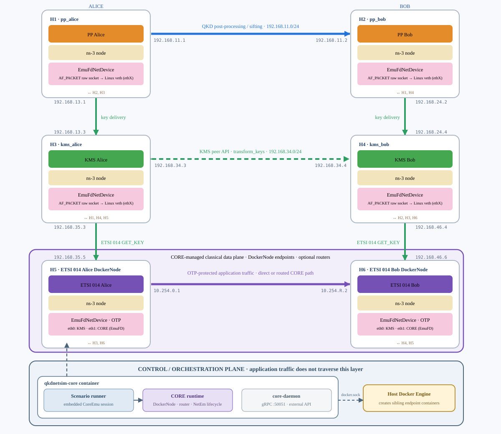
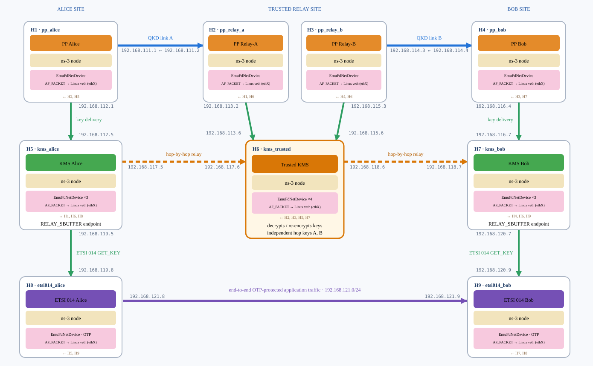
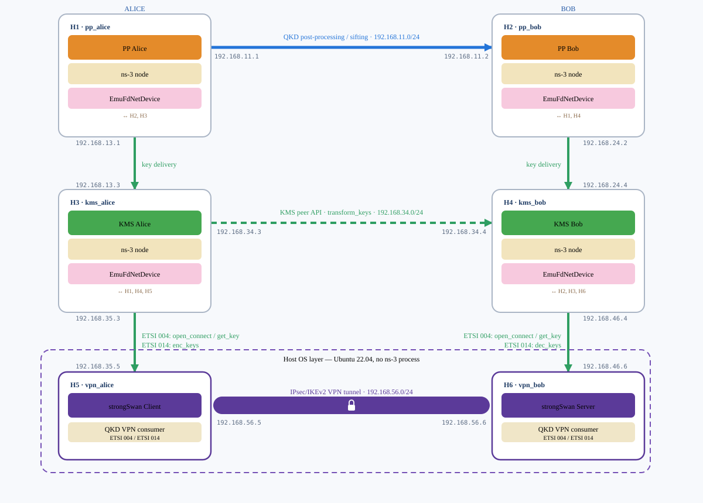
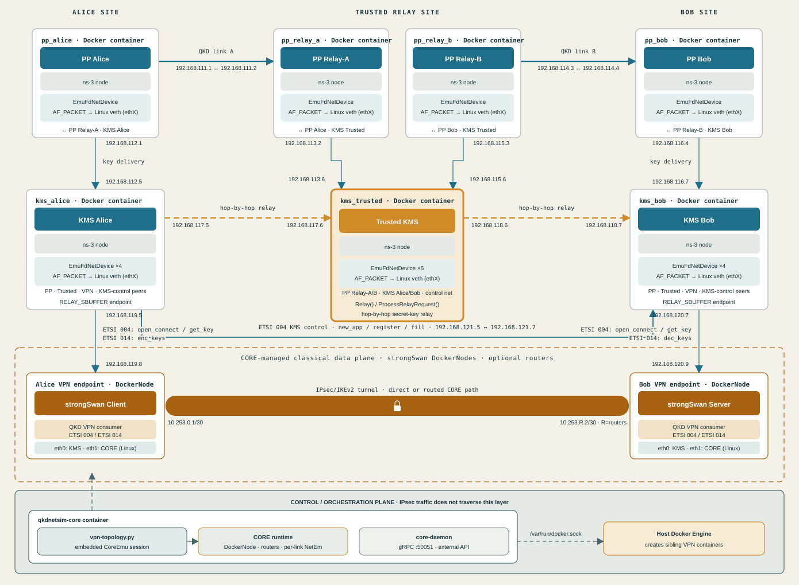

# QKDNetSim Testbed

This repository is a testbed built on top of
[QKDNetSim](https://www.qkdnetsim.info/). It provides real-network emulation
scenarios in which every node or role runs in its own Docker container and
communicates over actual network interfaces instead of being simulated inside
a single ns-3 process.

## Contents

- [Distance-aware QKD link budget](#distance-aware-qkd-link-budget)
- [CORE classical-network integration](#core-classical-network-integration)
- [Scenarios](#scenarios)
  - [1. Point-to-point](#scenario-point-to-point)
  - [2. Key relay](#scenario-key-relay)
  - [3. Point-to-point QKD-backed VPN](#scenario-point-to-point-vpn)
  - [4. Key-relay QKD-backed VPN](#scenario-key-relay-vpn)
- [Testbed additions to QKDNetSim](#testbed-additions-to-qkdnetsim)
- [External documentation](#external-documentation)

## Distance-aware QKD link budget

All four testbed scenarios derive the average secret-key generation rate of
each physical QKD link from its fiber length and attenuation. QKDNetSim
abstracts the quantum channel, so the calculation is performed before the
post-processing application starts and its result is assigned to the
`QKDPostprocessingApplication::KeyRate` attribute.

For a fiber of length $L$ and attenuation coefficient $\alpha$, the total
channel loss is:

$$
A_{\mathrm{dB}}(L) = \alpha L
$$

The corresponding fiber transmittance is:

$$
\eta(L) = 10^{-A_{\mathrm{dB}}(L)/10}
        = 10^{-\alpha L/10}
$$

The testbed uses a loss-budget-based key-rate model in which the rate scales
linearly with this transmittance:

$$
R_{\mathrm{model}}(L) = R_0\eta(L)
                       = R_0 10^{-\alpha L/10}
$$

where $L$ is expressed in kilometres, $\alpha$ in dB/km, $A_{\mathrm{dB}}$
in dB, $\eta$ is dimensionless, and $R_0$ is the configurable secret-key rate
before fiber loss.

The implementation uses general link-budget parameter names. Its current
default zero-loss rate is `17,094,000 bit/s`, calibrated from the equipment
and processing factors used to estimate the reference network links:

$$
\begin{aligned}
R_0 &= 10^9 \times 0.42 \times 0.50 \times 0.25
       \times 0.88 \times 0.37 \\
    &= 17{,}094{,}000\ \mathrm{bit/s}
\end{aligned}
$$

This model is supported by the following sources:

- Mehic et al., *Virtual Quantum Key Distribution Network Ecosystem: The
  National Czech QKD Network*, use the 85 km and 100 km reference links and
  report approximately 150 kbit/s and 85.083 kbit/s respectively
  ([IEEE Network, 2025](https://doi.org/10.1109/MNET.2025.3540705)).
- The source cited by that paper, Andrew Shields' *Performance Limits for
  Quantum Key Distribution Networks*, explicitly presents the equipment-factor
  product above, includes channel transmittance $\eta$, and identifies the
  loss-budget-dominated operating regime
  ([ITU-T workshop presentation, 2019](https://www.itu.int/en/ITU-T/Workshops-and-Seminars/2019060507/Documents/Andrew_Shields_Presentation.pdf)).
- Peer-reviewed QKD analyses use the same conversion from fiber distance and
  attenuation to transmittance, $T=10^{-\alpha L/10}$
  ([Scientific Reports, 2021](https://doi.org/10.1038/s41598-021-90055-3)).
- Fundamental rate-loss studies show that repeaterless optical QKD rates decay
  exponentially with distance and scale linearly with transmittance in the
  high-loss limit
  ([Nature Communications, 2014](https://doi.org/10.1038/ncomms6235);
  [Nature Communications, 2017](https://doi.org/10.1038/ncomms15043)).

With the published link parameters, the implementation reproduces the paper's
reported estimates:

| Fiber length | Attenuation | Total loss | Calculated `keyRate` |
|---:|---:|---:|---:|
| 85 km | 0.2417 dB/km | 20.5445 dB | 150,797 bit/s |
| 100 km | 0.2303 dB/km | 23.03 dB | 85,083 bit/s |

The paper's prose lists a 20% detector efficiency, while its reported rates
are reproduced by the 25% factor shown above. The implementation follows the
published rates and exposes `QKD_ZERO_LOSS_KEY_RATE_BPS` so experiments can
select a different equipment model explicitly instead of hiding that
assumption.

### Model scope

$R_{\mathrm{model}}=R_0\eta$ is a calibrated link-budget approximation, not a
universal or protocol-specific secret-key-rate equation. It is suitable for
the current experiments because it provides a transparent, reproducible way
to map fiber distance to QKDNetSim's average `KeyRate` and reproduces the
selected reference results.

It does not model QBER, detector dark counts, Raman noise, optical
misalignment, finite-key effects, or processing saturation as functions of
distance. A detailed BB84, decoy-state, CV-QKD, or other implementation would
need its own security and device model. The approximation must also not be
applied unchanged to protocols with different rate-loss scaling, such as
Twin-Field QKD, whose ideal scaling can approach $\sqrt{\eta}$ rather than
$\eta$. The configurable $R_0$ and attenuation parameters allow the current
model to be recalibrated, while a future protocol-specific model can replace
the calculation without changing the scenario architecture.

The two post-processing processes at the ends of one QKD link must receive
identical parameters. Compose enforces this automatically. Point-to-point and
point-to-point VPN scenarios use:

- `QKD_FIBER_LENGTH_KM` (default `85`)
- `QKD_FIBER_ATTENUATION_DB_PER_KM` (default `0.2417`)
- `QKD_ZERO_LOSS_KEY_RATE_BPS` (default `17094000`)

For example, run any point-to-point variant with the reference 100 km profile:

```bash
QKD_FIBER_LENGTH_KM=100 \
QKD_FIBER_ATTENUATION_DB_PER_KM=0.2303 \
docker compose -f docker/docker-compose.vpn.yml up -d
```

Key-relay and key-relay VPN scenarios configure both physical QKD segments
independently:

- `QKD_ALICE_RELAY_FIBER_LENGTH_KM` and
  `QKD_ALICE_RELAY_ATTENUATION_DB_PER_KM` (defaults: 85 km, 0.2417 dB/km)
- `QKD_RELAY_BOB_FIBER_LENGTH_KM` and
  `QKD_RELAY_BOB_ATTENUATION_DB_PER_KM` (defaults: 100 km, 0.2303 dB/km)
- the common `QKD_ZERO_LOSS_KEY_RATE_BPS`

Each post-processing process prints a `[QKD_LINK_BUDGET]` line containing the
fiber length, attenuation, total loss and resulting rate. This makes the
physical assumptions recorded in the container logs and allows a verifier or
experiment harness to confirm that both ends used the same link profile.

The original `examples_qkdnetsim_etsi_combined_input` scenario is not used by
the four Docker scenario families described below. It was nevertheless updated
because it is the generic topology-from-JSON entry point and already exposes
`srcDstDistance`; leaving it unchanged would make distance affect the Docker
links while being ignored by configurable JSON topologies. It now uses the
same calculation when a `qkd_links` entry contains
`fiberAttenuationDbPerKm`. In that JSON schema, `srcDstDistance` remains in
meters and `zeroLossKeyRateBps` is optional:

```json
{
  "srcDstDistance": 100000,
  "fiberAttenuationDbPerKm": 0.2303,
  "zeroLossKeyRateBps": 17094000
}
```

Old web-generated JSON files containing only `keyRate` remain supported, but
that value is treated as an explicitly configured rate and no distance calculation is
performed. The link-budget calculation changes only QKD key generation; it
does not yet emulate classical propagation delay. Classical delay will be
introduced separately with Linux `tc netem` or CORE so the optical model
and classical-network model can be varied independently.

## CORE classical-network integration

The CORE runtime is available under [`core/`](core/README.md). CORE is the
classical Alice–Bob network for every supported scenario. Post-processing, KMS
synchronization, physical QKD links and trusted key relay remain in the
QKDNetSim/Docker infrastructure; the two application endpoints are always
Docker nodes managed by a CORE session.

### From a Docker bridge to CORE

The initial testbed connected Alice and Bob directly through one shared
Docker bridge network: `192.168.56.0/24` in the point-to-point scenarios and
`192.168.121.0/24` in the key-relay scenarios. Docker provided one veth per
endpoint, so the classical path was always a single direct Ethernet segment.
This was sufficient to exchange synthetic application traffic or establish
the VPN, but it could not represent intermediate classical routers or assign
different network conditions to individual hops.

The current architecture keeps Docker only for the endpoint-to-KMS connection
on `eth0`. The second endpoint interface, `eth1`, is created and connected by
CORE. A CORE session can model either a direct Alice–Bob link or a path with
up to eight routers and applies independently configurable one-way delay,
bandwidth and packet loss to every link. This separates experiments on the
optical QKD distance/key rate from experiments on the classical path. The old
Docker bridge implementation is described here only as architectural history;
it is no longer present as an executable scenario.

The integration provides a reproducible, complete CORE 9.2.1 container with
EMANE, its Python bindings and OSPF-MDR. Its smoke tests validate Linux
namespaces, real Docker nodes, veth connectivity, NetEm delay and automatic
container cleanup. The classical topology runner provides selectable direct or
multi-router paths with independent per-link delay, bandwidth and loss.
`traffic-topology.py` places the ns-3 ETSI 014 consumers on that path;
`vpn-topology.py` places the native strongSwan consumers on the same path.
Each runner selects point-to-point QKD or trusted-node key relay without
changing the classical topology. Compose defines only persistent QKD/KMS
infrastructure; CORE is the sole owner of application endpoint creation,
classical links and cleanup. Commands and verification criteria are documented
in [`core/README.md`](core/README.md).

The architecture diagrams separate the classical data plane from its control
and orchestration plane. Each topology runner creates an embedded `CoreEmu`
session and uses the host Docker Engine, exposed through `docker.sock`, to
create the sibling endpoint containers. The simultaneously available
`core-daemon` exposes CORE's external gRPC management API on port 50051, but
the current runners do not send endpoint traffic—or their embedded session—
through that daemon. Application traffic traverses only the CORE-created veth,
bridge/router and NetEm path shown in the data plane.

## Scenarios

The diagrams and tables use `H1`–`H9` as compact deployment identifiers. Each
identifier represents a Docker container, but its architectural role may be
an ns-3 node, a KMS node, a synthetic QKD application, or a native Linux VPN
endpoint. Internal names are role-based as well: for example, Compose uses
`kms_trusted`, the corresponding container is `qkd-relay-kms-trusted`, the
binary is `relay_kms_trusted`, and its log marker is
`[RELAY_KMS_TRUSTED]`.

<a id="scenario-point-to-point"></a>

### 1. Point-to-point — direct Alice–Bob link (`examples/point-to-point/`)

Container-based adaptation of the network emulation experiment shown in Fig. 3 of:

> Mehic, M., Dervisevic, E., Burdiak, P., Lipovac, V., Fazio, P. and Voznak, M., 2024. *Emulation of quantum key distribution networks*. IEEE Network, 39(1), pp.116-123. https://doi.org/10.1109/MNET.2024.3398404

The paper simulates both ends of every link inside a single ns-3 process. In this testbed, every role runs in a separate Docker container. Each ns-3 `EmuFdNetDevice` opens an `AF_PACKET` raw socket bound to a Linux `ethX` interface backed by a Docker veth; this veth is the equivalent of the paper diagrams' “Real Net Device”. Native VPN endpoints do not use ns-3 or `EmuFdNetDevice`: strongSwan and the VPN consumer use the Linux network stack and Docker veth directly. The logical scenario is the same, but it is deployed as six independent nodes; the four QKD/KMS nodes are persistent Compose services and the two application nodes are transient CORE DockerNodes.

The six containers run Alice/Bob post-processing, Alice/Bob KMS, and Alice/Bob ETSI 014 applications. The QKD path is a direct Alice–Bob link without a trusted intermediate node. Their classical application path can be direct or contain CORE routers.



| Node ID | Container role | IPs (network ↔ peer) |
|---|---|---|
| H1 | post-processing Alice (ns-3 node) | 192.168.11.1 (↔H2), 192.168.13.1 (↔H3) |
| H2 | post-processing Bob (ns-3 node) | 192.168.11.2 (↔H1), 192.168.24.2 (↔H4) |
| H3 | KMS Alice (ns-3 node) | 192.168.13.3 (↔H1), 192.168.34.3 (↔H4), 192.168.35.3 (↔H5) |
| H4 | KMS Bob (ns-3 node) | 192.168.24.4 (↔H2), 192.168.34.4 (↔H3), 192.168.46.4 (↔H6) |
| H5 | ETSI 014 Alice (CORE DockerNode) | 192.168.35.5 (eth0 ↔H3), 10.254.0.1 (eth1 ↔CORE) |
| H6 | ETSI 014 Bob (CORE DockerNode) | 192.168.46.6 (eth0 ↔H4), 10.254.R.2 (eth1 ↔CORE) |

Quick start:

```bash
cd contrib/qkdnetsim-testbed
docker build -t qkdnetsim-testbed:latest -f docker/Dockerfile .
docker compose -f docker/docker-compose.yml up -d
docker compose -f docker/docker-compose.core.yml up -d --build core
docker compose -f docker/docker-compose.core.yml exec core \
  /opt/core/venv/bin/python /workspace/core/traffic-topology.py \
  --qkd-topology point-to-point --routers 0 --delay-ms 5 \
  --bandwidth-mbps 100 --loss-percent 0
```

Container creation order does not affect the scenario. Compose health checks and dependency conditions make the PP/KMS infrastructure converge first. The CORE runner explicitly waits for both endpoint KMS containers to become healthy, then creates both endpoint network namespaces, starts Bob before Alice, and retries the application-level operations until the selected timeout. The first PP link may take about one minute to converge because of ns-3 TCP backoff; no container restart is required.

The runner checks that both consumers request keys, observes encrypted
application traffic on TCP/8081 and verifies automatic endpoint cleanup. H5
and H6 use OTP with `useCrypto=1`. Set `--routers` above zero to insert CORE
routers; delay, bandwidth and packet loss apply independently to every link.

<a id="scenario-key-relay"></a>

### 2. Key relay — intermediate node without a direct Alice–Bob link (`examples/key-relay/`)

In this scenario, Alice and Bob do not have a direct QKD link. They communicate through a trusted intermediate node with its own KMS. The node relays keys using the functionality already provided by `QKDKeyManagerSystemApplication` (`RelayConsumption`, `WasteRelay`, `ConfigureRSBuffers`, and related methods), together with hop-by-hop OTP encryption through `skey_create`. Alice and Bob ultimately share actual key material without either endpoint seeing the raw key from the other QKD segment. End-to-end encrypted traffic flows between the H8 and H9 application nodes and is verified with temporary `tcpdump` samples.

Topology (9 Docker containers):



| Node ID | Container role | IPs (network ↔ peer) |
|---|---|---|
| H1 | PP Alice (ns-3 node) | 192.168.111.1 (↔H2), 192.168.112.1 (↔H5) |
| H2 | PP Relay-A (ns-3 node) | 192.168.111.2 (↔H1), 192.168.113.2 (↔H6) |
| H3 | PP Relay-B (ns-3 node) | 192.168.114.3 (↔H4), 192.168.115.3 (↔H6) |
| H4 | PP Bob (ns-3 node) | 192.168.114.4 (↔H3), 192.168.116.4 (↔H7) |
| H5 | **KMS Alice** (ns-3 node) | 192.168.112.5 (↔H1), 192.168.117.5 (↔H6), 192.168.119.5 (↔H8) |
| H6 | **KMS Relay** (trusted intermediate ns-3 node) | 192.168.113.6 (↔H2), 192.168.115.6 (↔H3), 192.168.117.6 (↔H5), 192.168.118.6 (↔H7) |
| H7 | **KMS Bob** (ns-3 node) | 192.168.116.7 (↔H4), 192.168.118.7 (↔H6), 192.168.120.7 (↔H9) |
| H8 | ETSI 014 Alice (CORE DockerNode) | 192.168.119.8 (eth0 ↔H5), 10.254.0.1 (eth1 ↔CORE) |
| H9 | ETSI 014 Bob (CORE DockerNode) | 192.168.120.9 (eth0 ↔H7), 10.254.R.2 (eth1 ↔CORE) |

Start the scenario:

```bash
cd contrib/qkdnetsim-testbed
docker build -t qkdnetsim-testbed:latest -f docker/Dockerfile .
docker compose -f docker/docker-compose.key-relay.yml up -d
docker compose -f docker/docker-compose.core.yml up -d --build core
docker compose -f docker/docker-compose.core.yml exec core \
  /opt/core/venv/bin/python /workspace/core/traffic-topology.py \
  --qkd-topology key-relay --routers 0 --delay-ms 5 \
  --bandwidth-mbps 100 --loss-percent 0
```

`depends_on` and the health checks start containers according to the readiness of their actual listeners. PP links use TCP reconnection and may take about one minute to converge because of ns-3 TCP backoff. Do not restart containers during this window.

#### End-to-end verification

The CORE runner waits for both endpoint key requests and encrypted TCP/8081
traffic before reporting success. Packet inspection is temporary and no
capture is stored in the repository.

#### Library issues fixed for this scenario

- **TCP sockets and startup ordering.** PP and KMS listeners publish readiness
  traces used by Compose health checks; ETSI endpoint traces are consumed by
  the CORE traffic runner. `QKDPostprocessingApplication` preserves its socket
  during `SYN_SENT`, allows TCP backoff to proceed, and reconnects after a
  failure or closure. Periodically destroying a socket during the handshake
  caused `TcpSocketBase` assertions when delayed packets arrived.
- **Incorrect framing of the post-processing TCP stream.** The receiver assumed that every `Recv()` call contained exactly one sent packet and constructed a `std::string` without an explicit length. TCP fragmentation or coalescing consequently caused `JSON parse error` and terminated the process. The receiver now keeps a buffer per connection, extracts frames delimited by `;`, preserves incomplete fragments, and discards malformed JSON without aborting the container.
- **Empty key material in `skey_create`.** `mergedKey` was consumed while splitting the local response and was then reused empty for the relay operation. An exact copy is now preserved, its size is validated, and the key is encrypted hop by hop. The H5 and H7 KMS nodes serve the same 6400-bit `keyId`.
- **Uninitialized ETSI 014 state.** `m_isSignalingConnectedToApp` and `m_isDataConnectedToApp` were read before initialization, causing some runs to skip socket creation. Both now start explicitly as `false`.
- **Encryption disabled in the scenario.** The H8 and H9 application nodes used `useCrypto=0`, so traffic described as OTP-protected was actually plaintext. The key-relay scenario now uses `useCrypto=1`.
- **Uninitialized bytes leaked into the wire (applies to both scenarios).** `QKDAppHeader::GetSerializedSize()` reserves a fixed 32 bytes for the authentication tag field, but `SetAuthTag()` wrote exactly `value.size()` bytes with no padding. With authentication disabled (`authenticationType=0`, the default in both scenarios), `QKDEncryptor::Authenticate()` returns an empty string, so the remaining 32 bytes of that reservation were left untouched — whatever the ns-3 `Buffer` previously held (in one observed case, a literal fragment of an unrelated HTTP response, `"Vary: Accept-Encoding, Cookie"`) was sent on the wire as-is. `SetAuthTag()` now pads with leading `'0'` characters the same way `SetEncryptionKeyId()`/`SetAuthenticationKeyId()` already did.
- **Bit accounting stuck in READY.** In `Relay()`, `StoreKey(key,true)` followed by `MarkKey(id,INIT)` has a net-zero effect on `m_currentKeyBit`. As a result, `CheckState()` stopped reflecting actual relay-buffer depletion after the threshold was crossed for the first time. `SBufferClientCheck` now also checks `GetSBitCount()`, which is the current count rather than historical accumulated state.
- **`skey_create` assumed one exact-size key.** Hop-by-hop encryption material was requested as a single key with an exact bit length, while the buffer only contained default 2048-bit keys. It now uses the same multi-key merge pattern through `GetTransformCandidate` that is already used elsewhere in the implementation.
- **Unbalanced HTTP request bookkeeping.** Multi-hop forwarding of `skey_create` sent the request to the next hop without adding it to `m_httpRequestsQueryKMS`. Processing the response then attempted to `pop()` an empty queue and terminated the process with `NS_FATAL_ERROR("HTTP query for this KMS is empty!")`.

**Endpoint timing:** H8 and H9 no longer depend on a fixed `appStartTime` delay.
The CORE runner waits until both endpoint KMS containers are healthy, creates
both endpoints, starts Bob before Alice, and waits for key requests and
application traffic. TCP/KMS retries absorb the remaining readiness window.

#### Infrastructure readiness and CORE endpoint startup

Originally, there was no guarantee that a server had reached `Listen()` before its client called `Connect()`. The following mechanisms now enforce the real dependency graph:

- Readiness traces in `QKDKeyManagerSystemApplication`,
  `QKDPostprocessingApplication`, and `QKDApp014`, emitted after `Bind()` and
  `Listen()` complete. Compose consumes PP/KMS readiness; the CORE runner
  consumes endpoint readiness and traffic markers.
- A role-specific readiness marker attached to each trace, for example `"[RELAY_KMS_ALICE] KMS Alice listening"`, alongside the existing `stores key` and `serves key` markers.
- `entrypoint.sh` mirrors stdout to `/tmp/qkdnetsim.log` inside each container. Docker health checks run inside the container namespace and cannot read the host-side `docker logs` view provided by the logging driver.
- Health checks on the PP and KMS infrastructure, plus a
  `depends_on: condition: service_healthy` chain that follows the QKD topology.
  H8 and H9 are subsequently created and ordered by CORE:

```
H7
  ├─ H6
  │    ├─ H2 ─ H1
  │    └─ H5
  ├─ H4 ─ H3
  └─ CORE: H9 (Bob) → H8 (Alice)
```

All four PP applications schedule a lightweight event every 100 ms so that `RealtimeSimulatorImpl` always has a nearby event. The entrypoint applies a fixed veth stabilization delay. There is no random jitter and no watchdog that terminates processes or recreates containers.

The image also applies `patches/realtime-simulator-clamp.patch` to ns-3.46. Under sustained load, the external `FdNetDevice` thread may observe a timestamp a few ticks behind `m_currentTs`. The original implementation aborts with `schedule for time < m_currentTs`; the patch schedules an already-late frame at the current valid timestamp and prevents the corresponding exit-code-139 failure.

PP convergence may take approximately one minute because ns-3 backs off after
the initial lost SYN packets. No separate verifier or manual timing is needed:
the CORE runner waits for healthy KMS endpoints and reports success only after
the required encrypted application traffic or VPN tunnel has been observed.

<a id="scenario-point-to-point-vpn"></a>

### 3. Point-to-point QKD-backed VPN — ETSI 004 and ETSI 014 (`docker/docker-compose.vpn.yml`)

Replaces the synthetic ETSI 014 application nodes at H5/H6 with real strongSwan IPsec/IKEv2 VPN endpoints. Instead of an ns-3 process encrypting synthetic traffic by hand, the H5 and H6 endpoints are native Ubuntu containers that periodically fetch real key material from the H3 and H4 KMS nodes and hand it to strongSwan as the connection's pre-shared key — the QKD stack's only remaining job is producing the key that protects a real IPsec tunnel. The overall architecture (a client/server pair of strongSwan encryptors fed by a periodic key-fetch script) follows:

> Mehic, M., Dervisevic, E., Fazio, P. and Voznak, M., 2025. *Virtual Quantum Key Distribution Network Ecosystem: The National Czech QKD Network*. IEEE Network. https://doi.org/10.1109/MNET.2025.3540705

The scenario supports both ETSI GS QKD 004 and ETSI GS QKD 014 so that
the two application interfaces can be compared over the same QKD link,
strongSwan configuration, key size and rekey interval. The use of ETSI GS
QKD 004 for session-based VPN key retrieval follows:

> Buruaga, J.S., Brunner, H.H., Fung, F., Peev, M., Pastor, A., López, D.R., Ortiz, L., Martín, V. and Brito, J.P., 2023. *VPN Protection with QKD-Derived Keys Using Standard Interfaces*. In 2023 23rd International Conference on Transparent Optical Networks (ICTON). IEEE. https://doi.org/10.1109/ICTON59386.2023.10207212

The H1–H4 ns-3 nodes and their networks are unchanged. The standalone Compose
project starts only that QKD/KMS infrastructure in the normal workflow. CORE
creates role-named `qkd-core-vpn-alice-<PID>` and
`qkd-core-vpn-bob-<PID>` transient DockerNode endpoints, connects their
`eth0` interfaces to the KMS networks and manages their classical `eth1`
interfaces.



**Interface selection.** ETSI 004 negotiates one `Key_stream_ID` (KSID) for
the complete VPN session. Alice sends that KSID once to Bob, which registers
the replica association with its own KMS. ETSI 014 instead obtains every new
key with `enc_keys`; Alice sends its `key_ID` to Bob, which retrieves the
matching material with `dec_keys`. Raw key material never crosses the endpoint
coordination channel in either mode. `QKD_INTERFACE=004` is the default;
setting it to `014` selects the second flow without changing the topology or
VPN parameters.

The same endpoint API is also available over the trusted-node path in
scenario 4. That case adds an internal KMS-to-KMS control plane because ETSI
GS QKD 004 defines the SAE-to-KMS stream API, but does not define how several
KMSs must construct one association across a trusted-node network. The
extension is described with the key-relay scenario below; it does not change
the ETSI 004 requests made by the VPN consumer.

**Transactional rekey cycle.** Alice drives each generation. With ETSI 004 it
obtains one `get_key(KSID)` result; with ETSI 014 it obtains one `enc_keys`
result and Bob retrieves its `key_ID` through `dec_keys`. Repeated control
requests are idempotent, so a lost response cannot consume an extra key on
only one side. The peers compare the ETSI 004 key index or ETSI 014 `key_ID`,
together with a SHA-256 fingerprint, before installing the secret.

For generation 2 and later, both peers temporarily remove the previous
strongSwan connection definition before initiation. This is required because
strongSwan otherwise reuses the previous IKE_SA and creates only another
CHILD_SA, which would not authenticate with the new QKD PSK. Alice closes the
old IKE_SA, initiates `qkd-N`, verifies that both endpoints report that exact
IKE_SA as `ESTABLISHED`, and commits the generation. This creates a short,
controlled cutover. If it fails, both endpoints restore the previous PSK and
connection and Alice re-establishes the previous generation.

The operation repeats every `REKEY_INTERVAL_S` (60 seconds by default).
`/run/qkd-vpn/state.json` contains only the KSID, generation, key index,
truncated fingerprint and status; raw keys are never written to state or logs.

Quick start with ETSI 004:

```bash
cd contrib/qkdnetsim-testbed
docker compose -f docker/docker-compose.yml down
docker build -t qkdnetsim-testbed:latest -f docker/Dockerfile .
docker build -t qkdnetsim-vpn-endpoint:latest -f docker/vpn/Dockerfile.vpn .
docker compose -f docker/docker-compose.vpn.yml up -d
docker compose -f docker/docker-compose.core.yml up -d --build core
docker compose -f docker/docker-compose.core.yml exec core \
  /opt/core/venv/bin/python /workspace/core/vpn-topology.py \
  --qkd-topology point-to-point --qkd-interface 004 \
  --routers 0 --delay-ms 5 --bandwidth-mbps 100 --loss-percent 0
```

Run the equivalent point-to-point VPN with ETSI 014 after the first run
finishes and removes its transient endpoints:

```bash
docker compose -f docker/docker-compose.core.yml exec core \
  /opt/core/venv/bin/python /workspace/core/vpn-topology.py \
  --qkd-topology point-to-point --qkd-interface 014 \
  --routers 0 --delay-ms 5 --bandwidth-mbps 100 --loss-percent 0
```

The runner verifies the selected interface, matching generation and key
fingerprint, the exact established IKE SA, successful ping, outbound ESP and
zero plaintext ICMP. Its transient endpoints and capture are deleted after
each run, while the QKD/KMS infrastructure may remain active for comparisons.

**Real (non-ns-3) client ↔ ns-3 KMS interoperability fix.** The H5/H6 VPN endpoints talk to their KMS nodes over ordinary kernel TCP/IP, not `EmuFdNetDevice` — this exposed a checksum-offload interoperability gap that never mattered for the rest of the testbed (the other ns-3 containers communicate with another ns-3/`EmuFdNetDevice` process, never with a native kernel network stack). A real client's outgoing TCP segments are marked for hardware checksum offload, which never gets filled in over a Docker veth pair; with `ChecksumEnabled=true`, ns-3 sees an invalid checksum on every segment and silently drops it (`TcpL4Protocol: Bad checksum, dropping packet!`), which looks like a hung TCP handshake from the outside even though ARP/ICMP work fine. `entrypoint.sh` and `entrypoint-vpn.sh` now both disable checksum/segmentation offload (`ethtool -K ... off`) on their managed interfaces — the Dockerfile had `ethtool` installed for exactly this purpose already, it just was never invoked.

#### How the VPN endpoints are implemented

`docker/vpn/Dockerfile.vpn` builds a small Ubuntu image with strongSwan,
Python and network diagnostics; it contains no ns-3 build. The entrypoint
disables veth offloads, renders the fixed IKEv2 transport-mode configuration
and starts strongSwan. `qkd-vpn.py` then implements the persistent KMS
connection, KSID registration, idempotent prepare/activate/commit/rollback
protocol, secret installation and exact IKE_SA validation.

The cipher suites are pinned to plugins available in Ubuntu 22.04:
`ike=aes256-sha256-modp2048!` and `esp=aes256-sha256!`. The program validates
`ipsec statusall` rather than trusting the exit code of `ipsec up`, because
that command can return success even when no matching IKE_SA was established.

<a id="scenario-key-relay-vpn"></a>

### 4. Key-relay QKD-backed VPN — ETSI 004 and ETSI 014 (`docker/docker-compose.key-relay-vpn.yml`)

This scenario keeps the complete trusted-node topology from scenario 2 and
replaces only the synthetic H8/H9 ETSI 014 application nodes with native
strongSwan endpoints:



The H1–H7 ns-3 nodes are extended unchanged from
`docker-compose.key-relay.yml`. CORE creates the two strongSwan DockerNode
endpoints and reuses the same interface-aware VPN consumer as scenario 3.
`--qkd-interface 004` selects the stream-oriented flow and `014` selects the
key-oriented flow without changing the topology or strongSwan parameters.

#### Relayed key acquisition

The existing QKDNetSim relay mechanism first supplies matching end-to-end key
objects to the `RELAY_SBUFFER`s at the H5 and H7 KMS nodes. H6 is a trusted KMS node:
it decrypts and re-encrypts the key material with independent hop keys while
forwarding it from H5 to H7. The VPN can consume that common material
through either application interface.

In ETSI 004 mode:

1. The H8 VPN endpoint calls `open_connect` on the H5 KMS node. H5 creates the master stream and
   sends an internal `new_app` control request through the H6 trusted KMS node. H7 creates
   the replica association with the same KSID. H8 receives the KSID only
   after that operation succeeds end to end.
2. H8 sends the KSID to the H9 VPN endpoint once. H9 calls `open_connect(KSID)` on
   the H7 KMS node, which sends an internal `register` request back through H6.
3. Once both SAEs are registered, H5 reserves complete key objects from
   its end-to-end relay buffer and sends a `fill` request containing their
   identifiers—not their secret values—to H7.
4. H7 resolves those identifiers from its matching relay buffer and
   inserts the material into its replica stream. Its acknowledgement causes
   H5 to commit the same objects to the master stream; rejected objects
   are returned to the relay buffer.
5. Each VPN generation uses the normal ETSI 004 `get_key(KSID)` endpoint.
   Alice and Bob compare the returned stream index and fingerprint before
   installing the PSK and performing the transactional IKE cutover.

The `new_app`, `register` and `fill` messages use the private
`/api/v1/associations/relay004/<request-id>` KMS endpoint. H6 is only a
hop-by-hop control proxy and keeps no ETSI 004 association. Each request
carries its origin, final KMS and previous hop, so responses follow the
reverse path and duplicate fills cannot overlap. This endpoint is an
internal QKDNetSim trusted-network extension, not an additional ETSI
SAE-to-KMS operation.

In ETSI 014 mode:

1. Alice requests one 256-bit key from the H5 KMS node with
   `enc_keys/<Bob SAE>/number/1/size/256`.
2. QKDNetSim creates and relays the end-to-end key through
   H5 → H6 → H7 using the existing trusted-node `skey_create`
   mechanism and hop-by-hop QKD protection.
3. Alice sends only the returned `key_ID` to Bob's coordination API.
4. Bob requests that exact identifier from the H7 KMS node with
   `dec_keys/<Alice SAE>`.
5. Both endpoints compare `key_ID` and key fingerprint, install the result as
   the strongSwan PSK, and perform the same transactional IKE cutover.

Raw key material never travels between the H8 and H9 VPN endpoints. The recurring
`key_ID` coordination is necessary because ETSI 014 is key-oriented rather
than stream-oriented; ETSI 004 only coordinates its KSID during association
setup and thereafter identifies each chunk by its monotonically increasing
stream index. Prepare requests are idempotent, so a lost response does not
make Bob consume another key.

#### Start and verify

The synthetic and VPN key-relay projects use the same explicit subnets, so
stop scenario 2 before starting scenario 4:

```bash
cd contrib/qkdnetsim-testbed
docker compose -f docker/docker-compose.key-relay.yml down
docker build -t qkdnetsim-testbed:latest -f docker/Dockerfile .
docker build -t qkdnetsim-vpn-endpoint:latest -f docker/vpn/Dockerfile.vpn .
docker compose -f docker/docker-compose.key-relay-vpn.yml up -d
docker compose -f docker/docker-compose.core.yml up -d --build core
docker compose -f docker/docker-compose.core.yml exec core \
  /opt/core/venv/bin/python /workspace/core/vpn-topology.py \
  --qkd-topology key-relay --qkd-interface 004 \
  --routers 0 --delay-ms 5 --bandwidth-mbps 100 --loss-percent 0
```

Run the same topology with ETSI 014 after the ETSI 004 run finishes:

```bash
docker compose -f docker/docker-compose.core.yml exec core \
  /opt/core/venv/bin/python /workspace/core/vpn-topology.py \
  --qkd-topology key-relay --qkd-interface 014 \
  --routers 0 --delay-ms 5 --bandwidth-mbps 100 --loss-percent 0
```

As in scenario 3, the runner confirms matching fingerprints and either ETSI
004 KSID/index or ETSI 014 `key_ID`, validates the exact IKE SA, and requires
real ping traffic to produce ESP with no plaintext ICMP.

#### Stream-index continuity

`SBuffer::InsertKeyToStreamSession()` now distinguishes a never-used stream
from an empty stream whose earlier chunks were consumed. Previously, an
empty buffer reused `m_currentStreamIndex`, causing a fast-consuming endpoint
to receive index `0` repeatedly while its peer continued with `1`, `2`, and
so on. The last assigned index is now retained and the next refill starts at
`last + 1`; this applies to both direct and relayed ETSI 004 associations.
After stream-buffer initialization the KMS also restores the
`Key_chunk_size` negotiated by `open_connect`, because the generic S-buffer
initializer otherwise replaced it with the relay-storage default. Thus both
VPN interfaces now supply the configured 256-bit PSK material even though
the relay layer transports larger storage blocks internally.

## Testbed additions to QKDNetSim

- **[`examples/point-to-point/`](examples/point-to-point/)** — six independent role-named ns-3 programs (`pp_alice.cc`, `pp_bob.cc`, `kms_alice.cc`, `kms_bob.cc`, `etsi014_alice.cc`, and `etsi014_bob.cc`). Compose runs the four persistent QKD/KMS roles and CORE runs the two transient application roles. Unlike the original module examples, which model both ends of every link in one process, these programs use the low-level QKDNetSim API and communicate over real networks through `EmuFdNetDevice`.
- **[`examples/key-relay/`](examples/key-relay/)** — the same pattern applied to a three-site relay topology with nine role-named programs: seven persistent QKD/KMS roles plus the two application roles instantiated by CORE. See `examples/CMakeLists.txt` and the build targets in `docker/Dockerfile`.
- **[`docker/`](docker/)** — the shared images, Compose definitions for persistent QKD/KMS infrastructure, and interface-aware entrypoints. Application endpoint topology and verification live exclusively under `core/`.
- **[`docker-compose.yml`](docker/docker-compose.yml)** — the four-service
  point-to-point QKD/KMS infrastructure. It deliberately contains neither
  Alice/Bob application services nor a classical data network.
- **[`docker-compose.key-relay.yml`](docker/docker-compose.key-relay.yml)** — the seven-service trusted-node QKD/KMS infrastructure and its readiness dependency chain. The two application endpoints are added by CORE at run time.
- **`entrypoint.sh`** — detects interfaces by subnet, normalizes veth devices, applies a fixed `NETWORK_SETTLE_MS`, and mirrors stdout to `/tmp/qkdnetsim.log` for health checks. It contains no watchdog or random jitter.
- **`verify-link-budget.sh`** — checks only the distance-to-key-rate model and
  its input validation. It does not create or verify an Alice–Bob classical
  path; end-to-end scenario verification belongs to the CORE runners.
- **Readiness traces** in KMS, post-processing, and ETSI 014 applications — emitted when their relevant listener sockets are active and consumed by Compose health checks.
- **[`model/qkd-kms-queue-logic.h`](model/qkd-kms-queue-logic.h) fix** — initializes `m_numberOfQueues` to its documented default of 3. Previously, the uninitialized value could cause multi-gigabyte allocations while starting any KMS.
- **[`model/qkd-key-manager-system-application.cc`](model/qkd-key-manager-system-application.cc)**
  — preserves the original direct ETSI 004 path and adds routed
  `new_app`/`register`/`fill` control transactions for multi-hop
  associations. Secret material is moved by the existing trusted-node relay;
  the new control messages carry only KSID, routing metadata and key IDs.
- **[`model/s-buffer.cc`](model/s-buffer.cc)** — maintains monotonically
  increasing ETSI 004 stream indices after a completely consumed stream is
  refilled.
- **[`examples/CMakeLists.txt`](examples/CMakeLists.txt)** — build entries for every scenario binary.
- **[`examples/qkd-link-budget.h`](examples/qkd-link-budget.h)** — shared,
  validated fiber-loss model used by the point-to-point, key-relay and
  topology-input post-processing applications. Compose passes the same
  physical parameters to both ends of every distributed QKD link.
- **[`docker/vpn/`](docker/vpn/)** — the strongSwan endpoint image, its
  interface-aware entrypoint, and the transactional ETSI 004/014 consumer
  (`qkd-vpn.py`).
- **[`docker-compose.core.yml`](docker/docker-compose.core.yml)** and
  **[`core/`](core/README.md)** — the common classical network used by all
  scenarios, including direct or routed paths with configurable per-link
  delay, bandwidth and loss, transient endpoint lifecycle, and end-to-end
  verification. The CORE README documents every runtime, smoke-test and
  topology-runner file individually.
- **[`docker-compose.vpn.yml`](docker/docker-compose.vpn.yml)** — the
  point-to-point VPN QKD/KMS infrastructure. The CORE VPN runner verifies
  synchronized key generations, real IKE PSK rotation and encrypted ESP
  traffic.
- **[`docker-compose.key-relay-vpn.yml`](docker/docker-compose.key-relay-vpn.yml)**
  — the selectable ETSI 004/014 seven-service key-relay VPN infrastructure. CORE
  supplies its two application endpoints and performs the end-to-end
  association, synchronized rotation and ESP verification.

---

## External documentation

This document is limited to the architecture, scenarios and implementation
details introduced by this testbed. General information about QKDNetSim,
including its architecture, installation, QKD models, KMS and ETSI GS QKD
004/014 interfaces, is available in the
[official QKDNetSim documentation](https://www.qkdnetsim.info/).

CORE's general architecture, installation procedures, node creation,
services, APIs and network-emulation facilities are described in the
[official CORE documentation](https://coreemu.github.io/core/). Details that
are specific to this repository—its container runtime, DockerNode lifecycle,
topology runners and verification commands—remain documented in the
[local CORE integration guide](core/README.md).
