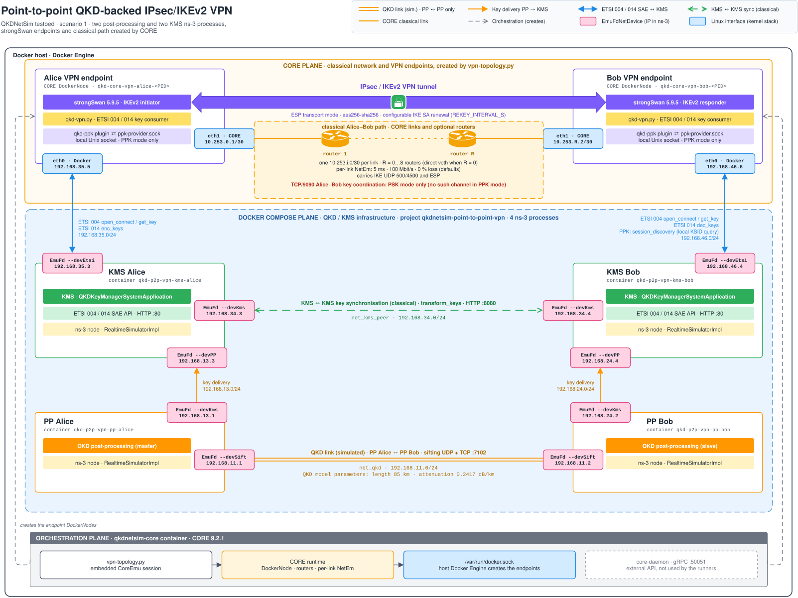
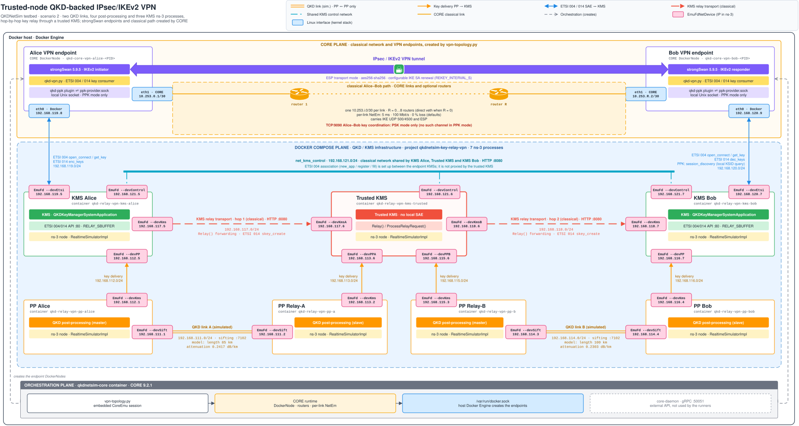

# QKDNetSim Testbed

This repository is a testbed built on top of
[QKDNetSim](https://github.com/QKDNetSim/qkdnetsim). It provides real-network emulation
scenarios in which every node or role runs in its own Docker container and
communicates over actual network interfaces instead of placing all logical
roles inside one conventional ns-3 simulation process.

## Contents

- [Architecture and motivation](#architecture-and-motivation)
  - [Research basis and testbed extensions](#research-basis-and-testbed-extensions)
- [Installation and execution](#installation-and-execution)
  - [Functional validation](#functional-validation)
  - [Monolithic versus distributed comparison](#monolithic-versus-distributed-comparison)
  - [Padua reference workload](#padua-reference-workload)
  - [Padua VPN integration stage](#padua-vpn-integration-stage)
  - [Optional QKD and post-quantum mixing](#optional-qkd-and-post-quantum-mixing)
  - [Validated results](#validated-results)
- [Distance-aware QKD link budget](#distance-aware-qkd-link-budget)
- [CORE classical-network integration](#core-classical-network-integration)
- [Scenarios](#scenarios)
  - [Old QKDNetSim application examples](#old-qkdnetsim-application-examples)
  - [1. Point-to-point QKD-backed VPN](#scenario-point-to-point-vpn)
  - [2. Key-relay QKD-backed VPN](#scenario-key-relay-vpn)
  - [3. RFC 8784 PPK-backed VPN](#scenario-ppk-vpn)
- [Testbed additions to QKDNetSim](#testbed-additions-to-qkdnetsim)
  - [Contribution overview](#contribution-overview)
  - [Upstream baseline and process separation](#upstream-baseline-and-process-separation)
  - [Multi-hop key-delivery adaptations](#multi-hop-key-delivery-adaptations)
- [External documentation](#external-documentation)

## Architecture and motivation

This testbed turns QKDNetSim scenarios into distributed emulation
environments. QKD post-processing, KMS and application roles execute as
independent processes with real Linux network interfaces, while Docker
Compose provides the persistent QKD/KMS infrastructure and CORE creates the
classical Alice-Bob topology and its transient endpoints. The result combines
QKDNetSim's repeatable key-generation and key-management models with real
network stacks, strongSwan and configurable direct or multi-hop classical
paths.

### Research basis and testbed extensions

The QKD topologies combine two published reference architectures
with extensions developed for this testbed. The earlier synthetic-traffic
prototypes are retained separately as project history.

| Testbed scenario | Research basis | Extension in this repository |
|---|---|---|
| Point-to-point VPN | QKD-fed strongSwan architecture from *Virtual Quantum Key Distribution Network Ecosystem: The National Czech QKD Network* | Reproducible Docker/CORE deployment with selectable ETSI 004 or ETSI 014 consumption |
| Key-relay VPN | Containerized key-relay topology and point-to-point strongSwan integration above | QKD-backed IPsec extended across the trusted-node path for both ETSI interfaces; this combined scenario is specific to this testbed |
| PPK-backed VPN | RFC 8784 PPK mixing in IKEv2 | A strongSwan credential plugin resolves each generation-specific `PPK_IDENTITY` directly through the endpoint's local QKDNetSim KMS; no Alice--Bob coordination service is used |

### Scope and standards terminology

The implementation separates three layers that must not be conflated:

1. **ETSI-facing application interface.** The native VPN consumer exercises
   the ETSI GS QKD 004 session semantics and the ETSI GS QKD 014
   `enc_keys`/`dec_keys` delivery semantics exposed by QKDNetSim. In both
   cases, the concrete HTTP/JSON messages and endpoint routing are those of
   QKDNetSim's implementation; this repository does not introduce an
   independent ETSI protocol stack. `Key_chunk_size` is encoded in bytes at
   the ETSI 004 boundary and converted to bits for QKDNetSim's internal buffer
   accounting. The testbed validates these implemented semantics; it does not
   claim complete wire-level conformance, certification, or demonstrated
   interoperability with commercial QKD equipment.
2. **Internal QKDNetSim relay.** `Relay()`, `skey_create` and the ETSI 004
   KMS-to-KMS association operations connect several simulated KMS nodes.
   They are implementation-specific KMS-to-KMS mechanisms, not multi-hop APIs
   defined by ETSI GS QKD 004 or ETSI GS QKD 014. The application-facing
   requests remain ETSI-shaped at Alice and Bob.
3. **VPN integration.** In the original four variants, the Python consumer
   installs each synchronized QKD-derived value as the strongSwan IKE
   authentication PSK. The additional PPK variants instead supply that value
   as a mandatory RFC 8784 post-quantum preshared key mixed into IKEv2's key
   schedule. It uses a separate, testbed-provisioned IKE authentication PSK;
   these two roles must not be conflated. Neither mode injects QKD material
   directly as an ESP key: strongSwan derives ESP traffic keys through IKEv2.
   The PSK mode retains the testbed's HTTP coordination API and must therefore
   be treated as an emulated integration demonstration. The PPK mode does not
   use that API: RFC 8784 carries an opaque `PPK_IDENTITY` in IKEv2 and a local
   strongSwan credential provider resolves it through the endpoint KMS.

By default, all delivered keys in this repository are generated by
QKDNetSim's QKD model. The optional hybrid mode combines that simulated QKD
material with an ML-KEM-512 shared secret. Terms such as “QKD-derived” and
“QKD-backed” describe their role in the emulation, not keys obtained from
physical QKD hardware. Likewise, “QKD+PQC” describes QKDNetSim's experimental
concatenation model; it is not a claim of a standardized combiner, a security
proof, or a standardized QKD/PQC combiner. PPK support is a separate IKEv2
integration, not a property of QKDNetSim's QKD/PQC mixing policy.

Accordingly, statements that a scenario “supports ETSI 004” or “supports ETSI
014” mean that its application follows the corresponding session or
key-delivery abstraction through QKDNetSim's API. They do not mean that ETSI
defines the trusted-node relay, the Alice--Bob coordination service, or the
strongSwan integration. The cited VPN papers motivate the consumption pattern
and provide comparison points; they do not turn these testbed-specific
components into standardized ETSI operations.

The reference emulation architecture in Mehic et al.,
[*Emulation of Quantum Key Distribution Networks*](https://doi.org/10.1109/MNET.2024.3398404),
places QKD components in separate virtual machines. This testbed applies the
same principle of distributing roles across isolated network hosts, but uses
Linux containers instead of one complete guest operating system per role.
Each container retains its own process tree, network namespace, interfaces,
routes and sockets; QKDNetSim reaches the corresponding Docker veth through
`EmuFdNetDevice`, and native VPN endpoints use the Linux network stack
directly.

The process boundary is therefore preserved rather than introduced by the
container conversion: the paper's point-to-point emulation assigns its six
roles to six VMs, each with an independent QKDNetSim/ns-3 execution. The first
prototype in this repository reproduced those six independent roles with
containers and QKDNetSim's synthetic consumers. That prototype is now
historical. In the supported VPN scenarios, the QKD post-processing and KMS
roles still run as independent ns-3 processes, while the application
containers run native strongSwan and the Python QKD key consumer. This differs
from conventional all-in-one QKDNetSim examples, where several simulated
nodes and applications can belong to one ns-3 process.

The VPN integration is based on Mehic et al.,
[*Virtual Quantum Key Distribution Network Ecosystem: The National Czech QKD Network*](https://doi.org/10.1109/MNET.2025.3540705),
where strongSwan consumes QKD-derived key material. That work provides the
application-integration pattern; this repository adapts it to the common
Docker/CORE architecture and then applies it to both the direct and trusted
key-relay QKD topologies.

The geographical and transport basis of the Czech experiment is not
arbitrary. It comes from
[CESNET3](https://www.cesnet.cz/en/sit-cesnet3-eng), the operational Czech
national research and education network. The paper uses data from its
deployed optical routes: 304 km and 70 dB between Prague and Brno, and 257 km
and 62 dB between Brno and Ostrava. Over that physical basis it anticipates
the Prague--Brno--Ostrava QKD backbone proposed by
[CZQCI](https://www.cesnet.cz/en/science).

CZQCI was still under consideration when the article was prepared and the
final QKD equipment was not known. The authors therefore represent the route
as five virtual QKD links joined by trusted nodes, divide it into nominal
100 km and 85 km segments, estimate the secret-key rates from optical and
device assumptions, and emulate the full Qiskit--QKDNetSim--strongSwan stack
on one host. Names such as `Prague1`, `Prague2` and `Brno1` denote logical
QKD roles rather than confirmed institutions or physical sites. The result
is a model calibrated against real research-network routes, not an exact
digital twin.

The distinction is also confirmed by the later deployment. The Czech
cybersecurity authority
[reported in July 2026](https://nukib.gov.cz/cs/kyberneticka-bezpecnost/nkc/projekty-nkc/)
that physical implementation had finished on 30 June 2026 with approximately
600 km and six QKD segments between Prague, Brno and Ostrava, plus commercial
and experimental metropolitan branches. The article's five-link topology is
therefore best understood as a pre-deployment experimental abstraction of the
national architecture that was subsequently built.

Containers were selected for this implementation because they provide:

- lower CPU, memory and storage overhead than a deployment based on one VM per
  role;
- faster creation and cleanup, which supports repeated experiments and larger
  topologies;
- reproducible images, dependencies, interface assignments and startup
  conditions through Docker and Compose;
- identical scenario definitions on native Linux and Docker Desktop; and
- direct integration with CORE's DockerNode lifecycle and per-link NetEm
  configuration.

This is an implementation choice rather than a claim that containers and VMs
are equivalent. Containers share the host Linux kernel and therefore provide
less isolation and do not reproduce hypervisor or guest-OS overhead. VMs
remain preferable when an experiment requires different operating systems,
stronger host boundaries, virtual-hardware effects or deployment across
independent hypervisors. The container approach is intended to study the QKD,
KMS, application and network behaviour of this testbed with lower operational
cost and greater experimental repeatability.

## Installation and execution

### Requirements

The recommended workflow runs the complete testbed in Linux containers and
requires:

- Git;
- Docker Engine with the Docker Compose plugin;
- Python 3.10 or newer for the host-side regression orchestrator;
- an x86-64 Linux host, or Docker Desktop configured to use Linux containers
  on Windows. Commands may be issued from PowerShell, WSL or a Linux shell.

The comparison-image builder discovers `python3`, `python` or the Windows
`py` launcher. If Python is installed elsewhere, set `QKD_PYTHON` to the
absolute path of a Python 3.10+ executable before running `build-all.sh`.

A pre-existing ns-3 or QKDNetSim installation is not required for this Docker
workflow. This repository contains the QKDNetSim module together with the
testbed changes. During the image build,
[`docker/Dockerfile`](docker/Dockerfile) clones ns-3.48, copies this checkout to
`contrib/qkdnetsim`, applies the required patches and compiles the scenario
binaries.

Clone the repository in any working directory:

```bash
git clone https://github.com/alemorenop/qkdnetsim-testbed.git
cd qkdnetsim-testbed
```

### Initial build

Build the QKDNetSim QKD/KMS image and the strongSwan VPN endpoint image:

```bash
docker build -t qkdnetsim-testbed:latest -f docker/Dockerfile .
docker build -t qkdnetsim-vpn-endpoint:latest -f docker/vpn/Dockerfile.vpn .
```

Build and start the shared CORE runtime:

```bash
docker compose -f docker/docker-compose.core.yml up -d --build core
```

The first build takes longer because ns-3, QKDNetSim, CORE, EMANE and the
routing components are compiled. Docker reuses these layers on subsequent
builds.

### Running a scenario

CORE is shared by both supported scenarios and normally remains running between
experiments. Each experiment then consists of two steps:

1. Start the selected persistent QKD/KMS infrastructure with its Compose
   file.
2. Execute `vpn-topology.py` to create and verify the strongSwan tunnel inside
   the CORE container.

For example, run the point-to-point VPN with ETSI 014 over a direct classical
link:

```bash
docker compose -f docker/docker-compose.vpn.yml up -d

docker compose -f docker/docker-compose.core.yml exec core \
  /opt/core/venv/bin/python /workspace/core/vpn-topology.py \
  --qkd-topology point-to-point --qkd-interface 014 \
  --routers 0 --delay-ms 5 \
  --bandwidth-mbps 100 --loss-percent 0
```

The runner waits for the infrastructure, creates the transient Alice and Bob
DockerNodes, verifies the end-to-end result and removes those endpoints when
the experiment finishes. Detailed commands for every VPN variant
are provided in the corresponding [scenario sections](#scenarios), while all
CORE topology parameters and smoke tests are documented in the
[local CORE integration guide](core/README.md).

Stop the example infrastructure and the shared CORE runtime when they are no
longer required:

```bash
docker compose -f docker/docker-compose.vpn.yml down
docker compose -f docker/docker-compose.core.yml down
```

### Functional validation

[`automation/run-regression.py`](automation/run-regression.py) is the
recommended functional check. It can build the images, starts the required
QKD/KMS and CORE infrastructure, runs the four PSK and four PPK VPN variants,
and cleans up their containers.

Run it from the repository root:

```bash
python3 automation/run-regression.py --build
```

On Windows, the equivalent command is `py -3 automation/run-regression.py
--build`. It covers:

1. point-to-point VPN with ETSI 004;
2. point-to-point VPN with ETSI 014;
3. key-relay VPN with ETSI 004;
4. key-relay VPN with ETSI 014;
5. point-to-point VPN with ETSI 004 and a mandatory RFC 8784 PPK;
6. point-to-point VPN with ETSI 014 and a mandatory RFC 8784 PPK;
7. key-relay VPN with ETSI 004 and a mandatory RFC 8784 PPK; and
8. key-relay VPN with ETSI 014 and a mandatory RFC 8784 PPK.

Success requires synchronized QKD generations, a matching newly established
IKE SA, one TCP session that remains active across every requested rekey,
retirement of the previous SA, ESP on the exterior path and no clear
application payload. A continuous ping remains as an auxiliary loss probe
during the cutover. Relay cases also
require evidence that the trusted-node path was exercised. A deliberate
key-mismatch case confirms that divergent KMS streams are rejected. A second
negative case deliberately gives Bob a different PPK while leaving the
same `PPK_IDENTITY`, so IKEv2 itself must reject the exchange.

`--traffic-duration` is the minimum TCP observation time. With more than one
generation, the runner adds one `--rekey-interval` per additional generation,
so the same `iperf3` connection starts after generation 1, crosses all SA
replacements and continues for the requested tail interval. For example,
`--min-generations 2 --rekey-interval 60 --traffic-duration 10` produces a
70-second TCP session rather than an unbounded process. The result records
average throughput, retransmissions, minimum one-second interval throughput
and intervals with zero throughput.

The JSON, CSV and log files written below `results/` are diagnostic evidence
for pass/fail investigation. They are not benchmark datasets and the runner
does not make performance claims or compare the distributed architecture with
QKDNetSim baselines. Useful shorter invocations are:

```bash
# One pass through all variants
python3 automation/run-regression.py --repetitions 1

# One selected case; repeat --case to select several
python3 automation/run-regression.py --case vpn-key-relay-etsi004
python3 automation/run-regression.py --case vpn-point-to-point-etsi004-ppk
python3 automation/run-regression.py --case vpn-key-relay-etsi014-ppk

# Display the matrix without accessing Docker
python3 automation/run-regression.py --list
```

Use `--help` for case selection and validation parameters.

After changing the imported QKDNetSim model, rebuild the working-tree image
and first run one pass of the VPN matrix. A short six-site run then exercises
the KMS trace names and the separate preparation/delivery accounting:

```bash
docker build -t qkdnetsim-testbed:latest -f docker/Dockerfile .
python3 automation/run-regression.py --repetitions 1
python3 automation/run-padua-reference.py --version working \
  --deployment distributed --time-scale 0.1 --repetitions 1
```

Inspect the last run's `key-accounting.csv` and KMS logs under `results/`.
The `working` Padua pair uses upstream QKDNetSim v3.1.4 for the monolithic
`base-new-reference` image and the v3.1.4-based working tree for the
distributed image. The historical `base-new` image remains pinned to v3.1.3
and is not used by this current Padua comparison.

Add `--pqc` to any positive functional run to recreate the endpoint KMSs with
forced hybrid delivery and require QKD/PQC contribution evidence. For example:

```bash
python3 automation/run-regression.py --pqc --repetitions 1
```

The forced and adaptive PQC campaigns include the eight positive VPN cases.
The two negative IKE authentication checks belong to the regular regression
matrix; either can still be selected explicitly with `--case` when needed.

Use `--pqc-adaptive` instead when the purpose is specifically to exercise the
`qBthr`-controlled policy without forced mixing. The functional fixture keeps
the S-buffer below READY and uses exponent 1 so a 512-bit VPN key contains
observable QKD and PQC contributions at both endpoints.

### Monolithic versus distributed comparison

[`automation/compare-architecture.py`](automation/compare-architecture.py)
is a separate performance-oriented runner. It compares two immutable
generations independently: old upstream QKDNetSim against the old distributed
toy-traffic testbed, and current upstream QKDNetSim against the corresponding
current testbed. The baseline remains a single ns-3 process; the testbed runs
one process per role in Docker and sends the application flow through CORE.

The comparison fixes the offered application load at 6.4 kbit/s with 800-byte
packets (approximately one packet per second), the QKD generation input at 10
kbit/s, three keys per ETSI 014 request and the post-processing key granularity
at 256 bytes. The same explicit prefetch policy is installed in all four
comparison images: an outbound application store requests the next batch when
it reaches a low-water mark of one key, and a per-store in-flight flag prevents
duplicate requests. This measures sustained delivery from a warmed key pipeline
rather than repeatedly timing an empty store. Keeping demand below QKD supply
prevents genuine buffer starvation from dominating the architecture comparison.
The upstream direct example is reduced from two application flows to the same
single Alice-to-Bob flow. The build instrumentation exposes the same workload
controls and application-level `Tx`/`Rx` observations on both sides; it does not
infer application packets from TCP segments, which may be fragmented or
coalesced.

Every workload starts with a five-second measurement warm-up after application
traffic first becomes possible. Counters are reset or gated at the end of this
period, so setup, the first key request and initially empty stores do not enter
the reported window. QKD generation and resource use are observed for the full
configured wall-clock interval. Application accounting treats that interval as
half-open and retains only the configured number of send opportunities, so a
packet scheduled exactly at the right boundary cannot produce an artificial
extra packet in one deployment. In the distributed six-site SECOQC fixture, each logical
KMS forwarding step also has a controlled 2 ms egress NetEm delay. The A--F
route therefore accumulates four such delays (A--B--C--E--F). The KMS processes
share a Docker control subnet, so this is a controlled per-forwarding-hop timing
model rather than a claim that the classical control plane uses six physically
separate links. The Alice--Bob application path remains a separate CORE path
with one router, two 2 ms links and 50 Mbit/s per link.

Both members of the current comparison pair also receive the same narrow
correctness repairs. The key-lifetime test is restricted to AES, as it was in
the old upstream revision; current upstream accidentally applies it to OTP and
discards keys on their first use. In addition, the QKD/PQC component sizes of
a batched request are consistently interpreted as bits per key, and
`skey_create` selects and reconstructs `key_size * key_number` bits at its
sender and receiver for both components. The original mixture of per-key and
per-request units otherwise emits empty contributions or lets validation pass
before aborting while constructing the complete batch. Applying the repairs to both
deployments prevents known protocol regressions from being mistaken for an
effect of process separation. Apart from these common repairs, QKDNetSim
protocol/model code in each pinned generation is retained.
These are fixes applied to the **pinned historical comparison images**, not a
description of the current working-tree image. Upstream v3.1.4 now splits
ETSI 014 QKD/PQC batches using total-batch contribution sizes; the active
testbed follows that convention and keeps each resulting key byte-aligned.
The comparison builds also remove a diagnostic assertion from
`SBuffer::GetTransformCandidate()`: `m_currentKeyBit` accounts for the whole
S-buffer, including already-reserved stream/supply material, whereas a new
transformation may select only READY keys from the transform pool. Equating
those quantities caused intermittent aborts under concurrent relay traffic.
The shared six-site fixture connects to the newer `RelaySuccess` confirmation
trace with `Config::ConnectFailSafe`; archived revisions that expose only
`RelayConsumption` therefore remain executable instead of aborting at startup.
Key generation rate is therefore a controlled input, not an
architecture-performance result.

Build the pinned comparison images once and run a small pilot:

```bash
bash docker/comparison/build-all.sh
python3 automation/compare-architecture.py \
  --version new --topology p2p --duration 10 --repetitions 1 \
  --workload-profile transport
```

The complete architecture study consists of two independent campaigns. Run
both profiles explicitly; omitting `--workload-profile` selects `transport`
only and is not a complete two-profile campaign:

```bash
# Process, container and emulated-network overhead without key consumption
python3 automation/compare-architecture.py \
  --version both --topology both --duration 60 --repetitions 5 \
  --workload-profile transport

# The same comparison with OTP/VMAC key acquisition and consumption enabled
python3 automation/compare-architecture.py \
  --version both --topology both --duration 60 --repetitions 5 \
  --workload-profile qkd
```

Each invocation creates its own timestamped result directory. Keep the two
summaries as separate experimental profiles: their measurements answer
different questions and their rows must not be pooled into one statistical
sample. Repeating one profile does not require rerunning the other when its
configuration, images and instrumentation have not changed.

Each run records application `Tx`/`Rx` delivery ratio, realization of the
offered load, useful-payload goodput (excluding the QKD application header),
on-wire frame bytes, exact `Mx` missed-send events,
wall-clock/realtime behaviour and aggregate Docker CPU and peak memory. The
output directory contains raw logs, one JSON record per execution,
`summary.json`, `summary.csv` and an automatically generated
`architecture-comparison.svg` with grouped means and standard-deviation error
bars.

The runner additionally exports a validation view modelled on Tables 2, 3 and 4
of Dervisevic *et al.*, *Large-Scale Quantum Key Distribution Network
Simulator*. `application-settings.csv` records the interface, offered
rate, packet size, cryptographic modes, key lifetime and configured timing.
The default `transport` profile uses no key consumption and isolates the cost of
processes, containers and emulated networking. It is only one half of the full
architecture study. The `qkd` profile selects OTP and VMAC key
acquisition/consumption while retaining `useCrypto=0`, so cryptographic
algorithm CPU time is not mistaken for deployment overhead. VPN encryption,
matching key fingerprints and rotations remain the responsibility of the
functional regression runner described above. Consequently, header-level
encryption-key uniqueness and OTP-protected-bit fields are not correctness
evidence in this profile; KMS delivery and consumption counters are.
`qkd-link-statistics.csv` records configured rate, generation interval,
generated key count, generated bits, average key size and observed generation
rate per QKD link. Relay and service totals that cannot be associated with a
physical-link UUID are written once as `aggregate_accounting`, rather than
being falsely copied onto every link. `application-statistics.csv`
records sent/received bytes and packets, exact missed sends, delivery,
requested keys and deduplicated logical keys consumed, with QKD and PQC
contributions separated where available. It also distinguishes keys delivered
in a KMS prefetch batch from identifiers actually present in application packet
headers: encryption/authentication operations, unique key IDs and OTP-protected
payload bits are reported separately. `buffer-timeseries.csv` contains
timestamped Q/S-buffer occupancy changes, and `key-accounting.csv` separates
supplied QKD/PQC material, relay
consumption and relay waste by KMS. Measurements in distributed runs are
deltas between snapshots taken immediately before and after the traffic
window, so infrastructure warm-up is excluded. A physical generated key logged
by both endpoint KMSs is deduplicated by link ID and key ID, equivalent to the
two-sided accounting correction used by the monolithic example. Empty cells
mean that the pinned example does not expose that trace; they are deliberately
not written as zero, which would incorrectly claim that the quantity was
observed and absent. In current mixed-key traces, only deliveries carrying a
non-empty KSID count as application consumption in Table 4. Empty-KSID events
are internal KMS-to-KMS material movements: they remain available in
`key-accounting.csv`, but are not attributed to the VPN application.

Upstream v3.1.4 separates `KeyPrepared` (material moved into an S-buffer)
from `KeyDelivered` (material supplied to an application), and renames the
generation, relay and waste trace sources to `KeyGenerated`, `KeyRelayed` and
`KeyWasted`. The distributed six-site fixture logs prepared and delivered
contributions with different markers; it does not add them together as
application deliveries. Its trace connections are optional so the pinned
older images, which lack these new sources, remain runnable. The historical
comparison CSVs retain their original schema and provenance; their values
should not be presented as measurements of the v3.1.4 working image.
For a v3.1.4 distributed Padua run, `key-accounting.csv` also includes
`prepared_keys`/`prepared_bits` separately from `supplied_keys`/`supplied_bits`.
The preparation columns remain empty when the source image has no such trace.
Preparation is not an application delivery: a prepared key may remain buffered
or be discarded when an ETSI 004 association closes. The two columns are
therefore not expected to match event by event.
The new `QKDApp004`/`QKDApp014` packet-cryptography traces belong to the
native C++ example consumers. The active VPN uses strongSwan instead, so its
encryption evidence remains IKE/ESP state and packet inspection, not those
ns-3 application traces.

`qkd-validation.svg` compares observed per-link generation rate and
application goodput. These values test different properties: the former checks
that the configured QKD supply is reproduced, while the latter exposes the
effect of process boundaries, real-time scheduling and external networking.
Raw link or relay totals must not be compared between topologically different
fixtures. The three-KMS `relay` case remains `reference_only`, whereas `secoqc`
is a paired comparison with the same six sites and six QKD links. The
instrumentation attaches to `QBuffer::CurrentChange` and
`SBuffer::CurrentChange`; it never reconstructs buffer histories from final
totals.

Both SVGs can also be regenerated without rerunning Docker:

The runner freezes the transmission window and allows a bounded two-second
receive drain so that a final in-flight TCP frame is not reported as loss. A
run fails if delivery is incomplete or any KMS trace reports a zero-bit key
contribution.

```bash
python3 automation/plot_architecture_comparison.py results/<campaign>/summary.json
```

Point-to-point and SECOQC are strict paired architecture comparisons. The
additional three-KMS Alice--trusted--Bob fixture is labelled `reference_only`
because no topologically identical upstream monolithic workload is used for
it. VPN correctness and rekey behaviour remain covered separately by the
functional runner above because comparing upstream toy traffic directly with
IPsec traffic would confound application and architecture effects.

### Padua reference workload

The two architecture campaigns above deliberately use a sustainable matched
load to isolate the monolithic/distributed boundary. A separate
`padua-reference` profile reproduces the workload behind Tables 2--4 of
Dervisevic *et al.* rather than incorrectly calling that topology SECOQC. Its
manifest is [`examples/comparison/padua-reference.json`](examples/comparison/padua-reference.json):
six QKD links generate for 100 seconds at 15 or 100 kbit/s with the reported
10, 30 or 50 kbit key sizes, while three ETSI 014 flows run from site 1 to 5,
5 to 1 and 1 to 6. Classical links use 100 Mbit/s and 2 ms. The first two
flows use OTP; 1--6 uses AES-256 with a 300,000-byte key lifetime.

Run a time-scaled pilot first, then the full 130-second workload:

```bash
./docker/comparison/build-all.sh base-new-reference

python3 automation/run-padua-reference.py \
  --version working --deployment distributed --time-scale 0.1 --repetitions 3

python3 automation/run-padua-reference.py \
  --version working --deployment both --time-scale 1 --repetitions 5
```

The runner executes the JSON-driven upstream example as the monolithic control
and six independent real-time KMS/ns-3 processes plus six CORE application
endpoints as the distributed counterpart. The image
`qkdnetsim:base-new-reference` uses upstream QKDNetSim v3.1.4 and ns-3's
discrete-event simulator, matching both the current distributed model version
and the purpose of the published monolithic experiment. The distributed processes
must use `RealtimeSimulatorImpl` because their TCP traffic crosses Docker veth
and CORE. Consequently, simulated protocol statistics are comparable, whereas
their wall-clock times are not an architecture-overhead result; use
`automation/compare-architecture.py` for that separate experiment. A full
campaign selects its distributed image explicitly through Compose; historical
`old`/`new` runs therefore do not overwrite the working-tree
`qkdnetsim-testbed:latest` tag used by the `working` profile. An unoptimised
monolithic run can take several minutes, so its timeout is a
900-second hang guard rather than the measurement window.

The runner writes `summary.json`,
`application-statistics.csv`, `qkd-link-statistics.csv`, raw logs and the
per-run distributed JSON. `qkd-link-statistics.csv` reports generated keys,
application-served material and only relay blocks whose end-to-end ACK was
received, which makes its `relayed_keys` column comparable in meaning with the
article. `key-accounting.csv` deliberately preserves both relay attempts and
confirmed relay blocks; their difference measures retry/rollback overhead in
the distributed control plane. Physical Q/S-buffer granularity is 512 bits,
as in the upstream SECOQC/reference setup. Application key-use events and
buffer time series are additional testbed measurements. Distributed runs also
separate missed sends caused by socket rejection (`missed_send_socket`) from
those caused by waiting for a key (`missed_send_key_wait`).
`padua-reference-comparison.csv` and `padua-reference-comparison.svg` compare
the monolithic and distributed executions separately for flows 1--5, 5--1 and
1--6. The plotted metric is useful goodput divided by each flow's offered
rate, with mean and standard-deviation error bars across repetitions. This
normalization avoids allowing the 10 Mbit/s AES flow to hide the two low-rate
OTP flows in an aggregate goodput value.

The current QKDNetSim baseline and the figures published with an earlier model
revision need not be numerically identical. The runner therefore keeps the
published table, the current monolithic control and the distributed testbed as
three distinct evidence sources. It does not silently use the paper values as
the current baseline.

Making the ETSI 014 application reliable across independent processes also
required transport adaptations that are irrelevant in a single ns-3 process:
listener sockets remain separate from accepted sockets; HTTP fragments are
reassembled per TCP socket; partial writes are queued; responses arriving on a
superseded socket are discarded instead of consuming a newer request's
correlation entry; malformed response streams trigger a clean reconnect and
request retry instead of terminating the application; failed `enc_keys`
responses also consume their correlation entry, preventing a later
authentication response from being mistaken for encryption material;
encryption and authentication refills are serialized because multislot relay
responses need not complete in request order; and key-ID proposals are
serialized until Bob acknowledges them. A destination relay batch that races
with a full buffer is rejected and rolled back rather than aborting the KMS.
OTP keys are removed after one use.
The test runner waits for receiver listeners and sender simulation completion;
these are bounded protocol/recovery checks, not watchdogs that restart a
container or hide a failed run.

The article labels authentication as SHA2, but QKDNetSim currently implements
VMAC, MD5 and SHA1 only. The profile therefore enables real OTP/AES execution
and disables authentication in both deployments. This makes the unsupported
field explicit instead of silently substituting a different algorithm; the
published SHA2 figures are reference values, not an exact authentication
reproduction claim.

### Padua VPN validation

[`automation/run-padua-vpn.py`](automation/run-padua-vpn.py) adds a system-level
VPN validation without replacing the controlled Padua comparison above. It reuses
the six distributed KMS sites and attaches strongSwan endpoints to sites 1 and
6. QKD material crosses the configured 1--2--3--6 trusted-node path through
ETSI GS QKD 014 and is installed as a mandatory RFC 8784 PPK. A single TCP
flow is paced to the paper's 10 Mbit/s offered load, uses 800-byte application
writes and remains active for 120 seconds across four fresh IKE SA
establishments. The classical endpoint path retains the reference 100 Mbit/s
bandwidth and 2 ms delay.

Run the single-flow campaign with:

```bash
python3 automation/run-padua-vpn.py \
  --repetitions 5
```

The runner writes per-run logs, `summary.json` and `vpn-statistics.csv`. The
VPN result is intentionally kept separate from the monolithic/distributed
QKDNetSim performance graph. QKDNetSim's reference application consumes QKD
keys for its own OTP/AES processing, whereas the VPN uses QKD as an IKE PPK and
lets IKEv2 derive the IPsec/ESP traffic keys. Comparing them as successive
performance stages would therefore mix different cryptographic workloads.
The VPN campaign instead validates offered-load achievement, TCP
retransmissions, ESP traffic and successful PPK generations against the VPN's
own configured workload.

The complete VPN profile extends that integration stage to the three Padua
applications running concurrently. It creates independent strongSwan endpoint
pairs for 1--5, 5--1 and 1--6, while all six endpoints share the same KMS and
trusted-node infrastructure. Their offered rates, application write sizes,
active durations and relative start offsets follow the reference workload:
7 kbit/s with 300 bytes, 14 kbit/s with 300 bytes and 10 Mbit/s with 800 bytes.
This intentionally exercises concurrent ETSI requests and relay activity on
the shared QKD paths rather than merging the two directions into one tunnel.
For both 1--5 directions, site 1 remains the ETSI 014 key supplier and the
second tunnel reverses only the application traffic. IPsec transport is
bidirectional, and making both KMSs independently reserve `enc_keys` from the
same physical pool would create two competing masters rather than reproduce
the reference application's opposite data direction.
The pilot scales durations, rekey intervals and relative start offsets
together so it does not move an initial connectivity probe onto a rekey
boundary.

Run a short pilot before the full five-repetition campaign:

```bash
python3 automation/run-padua-vpn-full.py \
  --time-scale 0.2 \
  --repetitions 1

python3 automation/run-padua-vpn-full.py \
  --repetitions 5
```

The full runner writes one result for each flow and repetition,
`summary.json` and `vpn-full-statistics.csv`. Its three VPN flows are evaluated
against their own offered rates; they are not merged into the controlled
QKDNetSim monolithic/distributed comparison.

### Optional QKD and post-quantum mixing

The common KMS image is built with liboqs 0.12.0 and the matching
liboqs-cpp wrapper, using ML-KEM-512. Runtime mixing is disabled by default,
so the commands in the scenario sections continue to exercise QKD-only key
delivery. Set the following Compose variables to enable the experimental
QKD+PQC path:

```bash
export QKD_PQC_ENABLED=1
export QKD_PQC_FORCE_MIXING=1
export QKD_PQC_SECURITY_EXPONENT=10
```

In PowerShell, use `$env:QKD_PQC_ENABLED="1"` and the equivalent assignments
for the other two variables. Recreate the selected infrastructure after
changing them, because Compose expands these values when it creates the KMS
containers. The regression runner's `--pqc` option performs these assignments
automatically. For a manual run, use for example:

```bash
docker compose -f docker/docker-compose.vpn.yml up -d --force-recreate
docker compose -f docker/docker-compose.core.yml exec -T core \
  /opt/core/venv/bin/python /workspace/core/vpn-topology.py \
  --qkd-topology point-to-point --qkd-interface 004 --require-pqc
```

Use `docker/docker-compose.key-relay-vpn.yml` and
`--qkd-topology key-relay` for the trusted-node case. `--require-pqc` makes
the runner require trace evidence of both QKD and PQC contributions at both
endpoint KMSs in addition to its normal synchronized-key, IKE-rekey, ESP and
plaintext-leakage checks.

`QKD_PQC_FORCE_MIXING=0` retains QKDNetSim's adaptive policy. Falling below
`qBthr` selects the allocation calculation; it does not by itself guarantee a
non-zero PQC contribution. The requested size, available QKD material and
`QKD_PQC_SECURITY_EXPONENT` determine the final split. With the normal
512-bit VPN request and exponent 10 the calculation can legitimately choose
an all-QKD result. Setting force mixing to `1` is the deterministic validation
mode; `automation/run-regression.py --pqc-adaptive` provides a deterministic
test of the threshold-driven branch itself. The exponent controls the
experimental allocation policy and does not select the ML-KEM security
category.

Each endpoint KMS owns two directional PQC pools. The local pool contains
ML-KEM secrets generated for and offered to its peer, while the receive pool
contains secrets decapsulated from that peer and is consume-only. Keeping the
pools separate prevents a KMS from satisfying an incoming identifier with its
own, different secret. The internal `enc`/`dec` buffers used by trusted-node
relay remain QKD-only: the endpoint-visible key is mixed exactly once, at the
ETSI delivery boundary. In ETSI 004, the hybrid `Key_buffer` is Base64 encoded
because ML-KEM output is arbitrary binary data; the VPN consumer decodes it
before installing the resulting value as the IKE PSK. ETSI 014 records and
reconstructs the QKD and PQC contributions for each delivered key ID.

Making the imported hybrid model usable in this distributed testbed required
several concrete corrections. The KMS now performs real ML-KEM-512
encapsulation and decapsulation instead of treating the exchanged value as
already shared material; accepts logical KMS node ID zero; keeps locally
generated and peer-decapsulated secrets in different pools; replenishes a pool
after consumption; and makes duplicate or delayed `fill` acknowledgements
idempotent. The total-batch/per-key split in ETSI 014 now comes from upstream
v3.1.4; the testbed aligns each component to a whole byte per key. ETSI 004
hybrid output is transported as Base64 rather than inserted as arbitrary bytes
in JSON. The implementation also enforces byte-aligned slices and validates
their ranges before reconstructing a mixed key; upstream v3.1.4 supplies the
inclusive endpoint when copying those slices. These are runtime and
correctness adaptations around QKDNetSim's imported concatenation policy,
not a replacement cryptographic combiner.

The current combiner is the one provided by the imported QKDNetSim model: it
concatenates the selected QKD and PQC contributions. No explicit KDF is
applied inside QKDNetSim. When the resulting value is supplied as an IKE PSK
or as a mandatory RFC 8784 PPK, IKEv2 applies strongSwan's normal PRF-based
key schedule to derive the IKE and ESP SAs. The PPK scenarios implement RFC
8784 at the IKE layer, but the QKDNetSim concatenation policy is not itself a
standardized RFC 8784 combiner and must not be described as direct ESP-key
injection.

### Validated results

The current validation set was completed between 25 and 29 September 2026,
after importing QKDNetSim v3.1.4 and replacing the former coordinated PPK
prototype with the dynamic local strongSwan provider. The immutable `old` and
`new` architecture images remain pinned to their documented historical
revisions; the Padua and VPN campaigns use the v3.1.4-based working image.

| Validation | Passed | Main observation |
|---|---:|---|
| Matched architecture, transport profile | 20/20 | 100% delivery and goodput retention at 6.4 kbit/s |
| Matched architecture, QKD profile | 20/20 | 100% delivery and goodput retention with real key consumption |
| Complete PSK/PPK VPN matrix | 10/10 | Eight positive cases passed and both deliberately inconsistent cases were rejected |
| Forced QKD/PQC delivery | 8/8 | QKD and PQC contributions were observed in all PSK/PPK interface and topology combinations |
| Adaptive QKD/PQC delivery | 8/8 | The threshold-controlled branch produced both contributions in all positive combinations |
| Full Padua reference workload | 10/10 | Five monolithic and five distributed v3.1.4 runs completed without packet loss |
| Full Padua VPN workload | 5/5 | All three concurrent flows completed in every run with verified PPK generations and ESP protection |

In both matched architecture profiles, every monolithic and distributed run
delivered the complete 6.4 kbit/s offered load. Distributing the roles increased
the mean aggregate CPU cost by 1.44--4.28 times and mean peak memory by
1.64--2.35 times across the four version/topology pairs. These resource ratios
describe the complete containerized deployment, not only the QKDNetSim
algorithm.

The complete functional VPN campaign covered point-to-point and trusted-node
topologies, ETSI 004 and ETSI 014, and both PSK and mandatory RFC 8784 PPK
keying. Every positive case sustained one 18-second TCP connection across two
verified IKE generations, carried traffic through ESP, exposed no clear
application payload and recorded no zero-throughput interval. Mean throughput
per run was 88.67--89.73 Mbit/s. The PPK cases also confirmed both local
provider sockets and the absence of the retired Alice--Bob TCP/9090
coordination service. The two negative cases verified fail-closed rejection of
divergent PSK material and of a different PPK returned for the same
`PPK_IDENTITY`.

The forced and adaptive QKD/PQC campaigns repeated all eight positive VPN
combinations against the v3.1.4-based image. Both campaigns confirmed non-zero
QKD and PQC contributions at the two endpoint KMSs in every case; they are
functional branch validations rather than performance benchmarks.

The full Padua campaign comprises five monolithic and five distributed runs of
the same v3.1.4 workload, with genuine one-time use enforced for OTP in both
deployments. Mean monolithic/distributed goodput was 5.294/5.088 kbit/s for
flow 1--5, 8.315/8.184 kbit/s for 5--1 and 4.621/6.286 Mbit/s for 1--6.
Every transmitted packet was delivered, and mean generated QKD material
differed by less than 0.6% on every physical link. The distributed traces
attribute every missed transmission opportunity to waiting for key material,
not to rejection by the application TCP socket.

Neither Padua reference deployment realises the complete offered load. The
1--2 and 2--3 QKD links each generate 15 kbit/s, while the two bidirectional
OTP applications alone request 7 + 14 kbit/s across that bottleneck. AES key
rotations and hop-by-hop relay protection add further demand. Larger buffers
can postpone depletion but cannot sustain demand above the generation rate.
The higher distributed value observed for 1--6 must therefore not be presented
as an architectural speed-up: the real-time and discrete-event deployments
schedule the capacity-constrained workload differently.

The additional full Padua VPN stage delivered 99.91%, 99.92% and 99.96% of the
configured 1--5, 5--1 and 1--6 application rates, respectively, across five
runs. This is a system-integration result, not a third equivalent
key-consumption baseline: the native QKDNetSim applications consume QKD
material for OTP or AES processing, whereas the VPN consumes one PPK per fresh
IKE SA and lets IKEv2 derive the ESP traffic keys.

### Optional native ns-3 development

Docker is the supported execution path for the emulation testbed. To compile
the module directly instead, use an ns-3.48 source tree and place this
repository at `ns-3-dev/contrib/qkdnetsim`. Native compilation also requires
the QKDNetSim system dependencies listed in its
[official documentation](https://www.qkdnetsim.info/models/build/html/qkdnetsim.html). Do not clone the
upstream QKDNetSim module first: this repository already contains that module
and the testbed-specific changes.

## Distance-aware QKD link budget

All four testbed scenarios derive the average secret-key generation rate of
each physical QKD link from its fiber length and attenuation. QKDNetSim
abstracts the quantum channel, so the calculation is performed before the
post-processing application starts and its result is assigned to the
`QKDPostprocessingApplication::KeyRate` attribute.

For a fiber of length $L$ and attenuation coefficient $\alpha$, the total
channel loss is:

$$
A_{\mathrm{dB}}(L) = \alpha L
$$

The corresponding fiber transmittance is:

$$
\eta(L) = 10^{-A_{\mathrm{dB}}(L)/10}
        = 10^{-\alpha L/10}
$$

The testbed uses a loss-budget-based key-rate model in which the rate scales
linearly with this transmittance:

$$
R_{\mathrm{model}}(L) = R_0\eta(L)
                       = R_0 10^{-\alpha L/10}
$$

where $L$ is expressed in kilometres, $\alpha$ in dB/km, $A_{\mathrm{dB}}$
in dB, $\eta$ is dimensionless, and $R_0$ is the configurable secret-key rate
before fiber loss.

The implementation uses general link-budget parameter names. Its current
default zero-loss rate is `17,094,000 bit/s`, calibrated from the equipment
and processing factors used to estimate the reference network links:

$$
\begin{aligned}
R_0 &= 10^9 \times 0.42 \times 0.50 \times 0.25
       \times 0.88 \times 0.37 \\
    &= 17{,}094{,}000\ \mathrm{bit/s}
\end{aligned}
$$

This model is supported by the following sources:

- Mehic et al., *Virtual Quantum Key Distribution Network Ecosystem: The
  National Czech QKD Network*, use the 85 km and 100 km reference links and
  report approximately 150 kbit/s and 85.083 kbit/s respectively
  ([IEEE Network, 2025](https://doi.org/10.1109/MNET.2025.3540705)).
- The source cited by that paper, Andrew Shields' *Performance Limits for
  Quantum Key Distribution Networks*, explicitly presents the equipment-factor
  product above, includes channel transmittance $\eta$, and identifies the
  loss-budget-dominated operating regime
  ([ITU-T workshop presentation, 2019](https://www.itu.int/en/ITU-T/Workshops-and-Seminars/2019060507/Documents/Andrew_Shields_Presentation.pdf)).
- Peer-reviewed QKD analyses use the same conversion from fiber distance and
  attenuation to transmittance, $T=10^{-\alpha L/10}$
  ([Scientific Reports, 2021](https://doi.org/10.1038/s41598-021-90055-3)).
- Fundamental rate-loss studies show that repeaterless optical QKD rates decay
  exponentially with distance and scale linearly with transmittance in the
  high-loss limit
  ([Nature Communications, 2014](https://doi.org/10.1038/ncomms6235);
  [Nature Communications, 2017](https://doi.org/10.1038/ncomms15043)).

With the published link parameters, the implementation reproduces the paper's
reported estimates:

| Fiber length | Attenuation | Total loss | Calculated `keyRate` |
|---:|---:|---:|---:|
| 85 km | 0.2417 dB/km | 20.5445 dB | 150,797 bit/s |
| 100 km | 0.2303 dB/km | 23.03 dB | 85,083 bit/s |

The paper's prose lists a 20% detector efficiency, while its reported rates
are reproduced by the 25% factor shown above. The implementation follows the
published rates and exposes `QKD_ZERO_LOSS_KEY_RATE_BPS` so experiments can
select a different equipment model explicitly instead of hiding that
assumption.

### Model scope

$R_{\mathrm{model}}=R_0\eta$ is a calibrated link-budget approximation, not a
universal or protocol-specific secret-key-rate equation. It is suitable for
the current experiments because it provides a transparent, reproducible way
to map fiber distance to QKDNetSim's average `KeyRate` and reproduces the
selected reference results.

It does not model QBER, detector dark counts, Raman noise, optical
misalignment, finite-key effects, or processing saturation as functions of
distance. A detailed BB84, decoy-state, CV-QKD, or other implementation would
need its own security and device model. The approximation must also not be
applied unchanged to protocols with different rate-loss scaling, such as
Twin-Field QKD, whose ideal scaling can approach $\sqrt{\eta}$ rather than
$\eta$. The configurable $R_0$ and attenuation parameters allow the current
model to be recalibrated, while a future protocol-specific model can replace
the calculation without changing the scenario architecture.

The two post-processing processes at the ends of one QKD link must receive
identical parameters. Compose enforces this automatically. Point-to-point and
point-to-point VPN scenarios use:

- `QKD_FIBER_LENGTH_KM` (default `85`)
- `QKD_FIBER_ATTENUATION_DB_PER_KM` (default `0.2417`)
- `QKD_ZERO_LOSS_KEY_RATE_BPS` (default `17094000`)

For example, run any point-to-point variant with the reference 100 km profile:

```bash
QKD_FIBER_LENGTH_KM=100 \
QKD_FIBER_ATTENUATION_DB_PER_KM=0.2303 \
docker compose -f docker/docker-compose.vpn.yml up -d
```

Key-relay and key-relay VPN scenarios configure both physical QKD segments
independently:

- `QKD_ALICE_RELAY_FIBER_LENGTH_KM` and
  `QKD_ALICE_RELAY_ATTENUATION_DB_PER_KM` (defaults: 85 km, 0.2417 dB/km)
- `QKD_RELAY_BOB_FIBER_LENGTH_KM` and
  `QKD_RELAY_BOB_ATTENUATION_DB_PER_KM` (defaults: 100 km, 0.2303 dB/km)
- the common `QKD_ZERO_LOSS_KEY_RATE_BPS`

Each post-processing process prints a `[QKD_LINK_BUDGET]` line containing the
fiber length, attenuation, total loss and resulting rate. This makes the
physical assumptions recorded in the container logs and allows a verifier or
experiment harness to confirm that both ends used the same link profile.

The original `examples_qkdnetsim_etsi_combined_input` scenario is not used by
the two active Docker QKD/KMS topologies described below. It was nevertheless updated
because it is the generic topology-from-JSON entry point and already exposes
`srcDstDistance`; leaving it unchanged would make distance affect the Docker
links while being ignored by configurable JSON topologies. It now uses the
same calculation when a `qkd_links` entry contains
`fiberAttenuationDbPerKm`. In that JSON schema, `srcDstDistance` remains in
meters and `zeroLossKeyRateBps` is optional:

```json
{
  "srcDstDistance": 100000,
  "fiberAttenuationDbPerKm": 0.2303,
  "zeroLossKeyRateBps": 17094000
}
```

Old web-generated JSON files containing only `keyRate` remain supported, but
that value is treated as an explicitly configured rate and no distance calculation is
performed. The link-budget calculation changes only QKD key generation; it
does not yet emulate classical propagation delay. Classical delay will be
introduced separately with Linux `tc netem` or CORE so the optical model
and classical-network model can be varied independently.

## CORE classical-network integration

The CORE runtime is available under [`core/`](core/README.md). CORE is the
classical Alice–Bob network for every supported scenario. Post-processing, KMS
synchronization, physical QKD links and trusted key relay remain in the
QKDNetSim/Docker infrastructure; the two application endpoints are always
Docker nodes managed by a CORE session.

### From a Docker bridge to CORE

The initial testbed connected Alice and Bob directly through one shared
Docker bridge network: `192.168.56.0/24` in the point-to-point scenarios and
`192.168.121.0/24` in the key-relay scenarios. Docker provided one veth per
endpoint, so the classical path was always a single direct Ethernet segment.
This was sufficient to exchange synthetic application traffic or establish
the VPN, but it could not represent intermediate classical routers or assign
different network conditions to individual hops.

The current architecture keeps Docker only for the endpoint-to-KMS connection
on `eth0`. The second endpoint interface, `eth1`, is created and connected by
CORE. A CORE session can model either a direct Alice–Bob link or a path with
up to eight routers and applies independently configurable one-way delay,
bandwidth and packet loss to every link. This separates experiments on the
optical QKD distance/key rate from experiments on the classical path. The old
Docker bridge implementation is described here only as architectural history;
it is no longer present as an executable scenario.

The integration provides a reproducible, complete CORE 9.2.1 container with
EMANE, its Python bindings and OSPF-MDR. Its smoke tests validate Linux
namespaces, real Docker nodes, veth connectivity, NetEm delay and automatic
container cleanup. The classical topology laboratory provides selectable
direct or multi-router paths with independent per-link delay, bandwidth and
loss. The supported `vpn-topology.py` runner places the native strongSwan
consumers on that path and selects point-to-point QKD or trusted-node key
relay without
changing the classical topology. Compose defines only persistent QKD/KMS
infrastructure; CORE is the sole owner of application endpoint creation,
classical links and cleanup. Commands and verification criteria are documented
in [`core/README.md`](core/README.md).

The architecture diagrams separate the classical data plane from its control
and orchestration plane. Each topology runner creates an embedded `CoreEmu`
session and uses the host Docker Engine, exposed through `docker.sock`, to
create the sibling endpoint containers. The simultaneously available
`core-daemon` exposes CORE's external gRPC management API on port 50051, but
the current runners do not send endpoint traffic—or their embedded session—
through that daemon. Application traffic traverses only the CORE-created veth,
bridge/router and NetEm path shown in the data plane.

The canonical editable diagram sources live in
[`diagrams/src/`](diagrams/src/) as Draw.io XML files (`*.drawio`). The adjacent
SVG files are the publication exports used by this README and by the LaTeX
documentation; they are kept as portable renderings, not as independent
sources. Changes must therefore be made in Draw.io and then exported to SVG.
The export uses plain SVG text (no HTML `foreignObject`), a fixed light theme
and an embedded copy of the diagram, so the SVG can also be reopened in
Draw.io:

```bash
drawio -x -f svg -e --theme light --embed-svg-fonts false -o diagrams/key-relay-vpn.svg diagrams/src/key-relay-vpn.drawio
```

Each figure separates three planes: the Docker Compose plane with the
persistent QKD/KMS ns-3 processes, the CORE plane with the VPN endpoints and
the classical path, and the orchestration plane in the `qkdnetsim-core`
container.
The project-specific palette is intentionally independent of the visual
styling of the reference papers. The figures retain the implementation-level
information of the original drawings: every
process boundary, `EmuFdNetDevice`, Linux veth/`AF_PACKET` boundary, Docker
subnet and endpoint address, ETSI operation, CORE component and data-plane
address is shown next to the component or connector to which it belongs.

### Addressing contract

Compose assigns a `.254` gateway to every persistent `/24` Docker network.
The addresses below are the static interface values shared by Compose, the
C++ defaults, `core/vpn-topology.py` and the active diagrams.

| Point-to-point subnet | Endpoint A | Endpoint B |
|---|---|---|
| `192.168.11.0/24` | PP Alice `192.168.11.1` | PP Bob `192.168.11.2` |
| `192.168.13.0/24` | PP Alice `192.168.13.1` | KMS Alice `192.168.13.3` |
| `192.168.24.0/24` | PP Bob `192.168.24.2` | KMS Bob `192.168.24.4` |
| `192.168.34.0/24` | KMS Alice `192.168.34.3` | KMS Bob `192.168.34.4` |
| `192.168.35.0/24` | KMS Alice `192.168.35.3` | Alice VPN `192.168.35.5` |
| `192.168.46.0/24` | KMS Bob `192.168.46.4` | Bob VPN `192.168.46.6` |

| Key-relay subnet | Endpoint A | Endpoint B |
|---|---|---|
| `192.168.111.0/24` | PP Alice `192.168.111.1` | PP Relay-A `192.168.111.2` |
| `192.168.112.0/24` | PP Alice `192.168.112.1` | KMS Alice `192.168.112.5` |
| `192.168.113.0/24` | PP Relay-A `192.168.113.2` | KMS Trusted `192.168.113.6` |
| `192.168.114.0/24` | PP Relay-B `192.168.114.3` | PP Bob `192.168.114.4` |
| `192.168.115.0/24` | PP Relay-B `192.168.115.3` | KMS Trusted `192.168.115.6` |
| `192.168.116.0/24` | PP Bob `192.168.116.4` | KMS Bob `192.168.116.7` |
| `192.168.117.0/24` | KMS Alice `192.168.117.5` | KMS Trusted `192.168.117.6` |
| `192.168.118.0/24` | KMS Trusted `192.168.118.6` | KMS Bob `192.168.118.7` |
| `192.168.119.0/24` | KMS Alice `192.168.119.5` | Alice VPN `192.168.119.8` |
| `192.168.120.0/24` | KMS Bob `192.168.120.7` | Bob VPN `192.168.120.9` |

The CORE VPN path uses one `/30` per classical link. With `R` routers,
`vpn-topology.py` creates `10.253.i.0/30` for `i = 0 ... R`. Alice is always
`10.253.0.1/30`; Bob is `10.253.R.2/30`. Consequently the direct case
(`R = 0`) uses `10.253.0.1/30` and `10.253.0.2/30`. Router interfaces occupy
the `.2` address of the link on their Alice-facing side and the `.1` address
of the following link. The notation `10.253.R.2` in the diagrams is therefore
parameterized, not a literal IPv4 address.

## Scenarios

All commands in this section are run from the repository root.

The active architecture diagrams use role names such as `PP Alice`,
`KMS Trusted` and `Alice VPN endpoint`; they do not require the reader to map
the design through opaque host numbers. Historical figures, source comments
and some diagnostic tables may retain `H1`–`H9` as compact deployment
identifiers. Each identifier represents a Docker container, but its role may
be an ns-3 post-processing node, a KMS node, or a native Linux VPN endpoint.
Current internal names are role-based as well: for example, Compose uses
`kms_trusted`, the corresponding container is `qkd-relay-kms-trusted`, the
binary is `relay_kms_trusted`, and its log marker is
`[RELAY_KMS_TRUSTED]`.

<a id="old-qkdnetsim-application-examples"></a>

### Old QKDNetSim application examples (`old-examples/`)

Before introducing strongSwan, the testbed was developed through two
QKDNetSim-native prototypes. They are no longer active scenarios and do not
appear in the VPN regression matrix. They remain reproducible, however, and
established the distributed architecture while exposing library faults that
also affected the QKD/KMS pipeline now used by the VPN scenarios.

Their source code and reproduction commands remain under `old-examples/`, but
the obsolete HTML/SVG diagram copies have been removed. The active, maintained
figures in [`diagrams/`](diagrams/) describe the current Docker/CORE VPN
architecture; historical H1--H9 identifiers and the C++ `QKDApp014`/OTP data
plane are retained only in the corresponding prototype text and sources.

#### Direct point-to-point prototype

The first prototype separated the six roles of the reference emulation into
six independent ns-3 processes: Alice/Bob post-processing, Alice/Bob KMS and
two `QKDApp014` consumers. The consumers requested matching ETSI 014 keys and
used QKDNetSim's OTP mode to protect synthetic TCP/8081 traffic over the CORE
classical path. It demonstrated that:

- `EmuFdNetDevice` could connect independent ns-3 processes through Docker
  veth interfaces instead of keeping all roles in one simulation;
- the PP pair delivered correlated material to two independent KMSs;
- the ETSI 014 `enc_keys`/`dec_keys` flow returned the same key at both
  endpoints; and
- CORE could create the application endpoints and a direct or routed
  Alice-Bob path independently of the QKD link.

#### Trusted-node key-relay prototype

The second prototype extended the same pattern to nine independent roles:
four post-processing processes, Alice/trusted/Bob KMSs and two ETSI 014
consumers. It demonstrated that two independent QKD links could feed a
trusted KMS, that QKDNetSim's relay could establish matching end-to-end
buffers, that `skey_create` could synchronize the delivered key IDs, and that
the consumers could protect the synthetic application flow. Most of the difficult defects
were exposed here because requests, buffers and responses crossed three KMS
processes rather than one direct pair.

#### QKDNetSim and ns-3 issues exposed by the prototypes

The prototypes exposed two different classes of defects. The first group is
still exercised by the current VPN scenarios because their PP/KMS containers
use the same QKDNetSim classes and relay machinery. The second group belongs
to the retired C++ `QKDApp014` data-plane consumer: its corrections remain in
the library, but the active VPN uses `qkd-vpn.py` and strongSwan instead and
does not execute those paths.

##### Corrections exercised by the active VPN scenarios

- **TCP sockets and startup ordering.** PP and KMS listeners now publish
  readiness traces consumed by Compose health checks. A connecting
  `QKDPostprocessingApplication` preserves its socket while it is in
  `SYN_SENT`, lets TCP backoff proceed and reconnects only after a confirmed
  failure or closure. Repeatedly destroying a socket during the handshake had
  produced `TcpSocketBase` assertions when delayed packets arrived.
- **PP-neighbor recovery.** A failed initial ARP lookup on an emulated QKD link
  was retained by ns-3 for its default 100-second dead-entry interval. The PP
  interfaces keep normal ARP resolution but reduce that interval to one second,
  so a peer that finishes starting moments later can be resolved without a
  container restart. This setting is limited to the dedicated PP links.
- **Incorrect framing of the post-processing TCP stream.** A `Recv()` callback
  was incorrectly treated as exactly one sent JSON message and a
  `std::string` was constructed without its explicit byte length. TCP
  fragmentation or coalescing therefore caused `JSON parse error` and process
  termination. The receiver now maintains a buffer per connection, extracts
  `;`-delimited frames, preserves incomplete suffixes and rejects malformed
  JSON without aborting the container.
- **Redundant key transport in `skey_create`.** An earlier correction preserved
  `mergedKey` after it had been consumed locally and transported a second,
  hop-encrypted copy toward Bob. Reviewing the complete relay lifecycle showed
  that `Relay()` had already installed identical key IDs and material in both
  endpoint `RELAY_SBUFFER`s: the source retains each original object while the
  destination reconstructs it with the same `key_ID` after the hop-by-hop OTP
  transformation. The additional `ekey`/`hop_key_ID` path therefore repeated
  the secret transport, consumed another set of link keys and introduced a
  second state machine that could diverge from `Relay()`. `skey_create` now
  performs only its remaining control function: it carries candidate and
  supply IDs, and Bob resolves the material from its existing end-to-end
  buffer.
- **Relay bit accounting stuck in `READY`.** In `Relay()`, the combination of
  `StoreKey(key, true)` and `MarkKey(id, INIT)` had a net-zero effect on
  `m_currentKeyBit`; after crossing the threshold once, `CheckState()` no
  longer represented current depletion. `SBufferClientCheck` now also uses
  `GetSBitCount()`, which reports the present content rather than historical
  accumulated state.
- **Transform-pool assertion under concurrency.** `m_currentKeyBit` is global
  S-buffer accounting and may include keys already reserved in ETSI 004 stream
  or application supply pools. `GetTransformCandidate()` can select only READY
  material from `m_keys`; asserting equality between that selectable pool and
  the global counter intermittently terminated a KMS when concurrent relay
  flows accumulated reserved keys. Availability now uses
  `GetTransformBitCount()`, and the selector no longer treats the diagnostic
  accounting comparison as a fatal invariant.
- **`skey_create` response semantics.** A forwarded multi-hop request was once
  acknowledged immediately by the trusted KMS and was not fully represented
  in `m_httpRequestsQueryKMS`. KMS Alice could therefore consider the internal
  synchronization successful before KMS Bob stored the supply keys. Every
  forwarded query now records its previous hop and original URI; only the
  destination result is proxied back along the reverse path, providing an
  end-to-end KMS confirmation. This acknowledgement does not delay Alice's
  application-facing `enc_keys` response. The VPN completes that higher-level
  transaction only after Bob retrieves the indicated key, verifies its
  fingerprint and accepts `/prepare`.
- **Late external frames in the real-time scheduler.** Under load, the
  `FdNetDevice` thread could supply a timestamp just behind `m_currentTs`, and
  ns-3 aborted with `schedule for time < m_currentTs`. The scoped
  `realtime-simulator-clamp.patch` schedules an already-late external frame at
  the current valid time without changing future-event ordering, preventing
  the observed process termination reported by Docker as exit code 139.

The TCP, framing, readiness and real-time corrections are exercised by both
point-to-point and key-relay VPNs. Relay-buffer accounting is exercised by the
key-relay infrastructure with either ETSI interface. Identifier-only
`skey_create` synchronization and its end-to-end acknowledgement are specific
to the ETSI 014 key-relay path; the direct point-to-point flow uses the same
message format without an intermediate proxy.

##### Corrections retained for the historical QKDApp consumers

- **Uninitialized ETSI 014 application state.** `QKDApp014` read
  `m_isSignalingConnectedToApp` and `m_isDataConnectedToApp` before
  initialization, so some executions skipped socket creation. Both flags now
  start explicitly as `false`.
- **Encryption disabled in the relay prototype.** Its C++ consumers used
  `useCrypto=0`, although the traffic was described as OTP-protected. The
  prototype was corrected to `useCrypto=1`. This discovery also motivated the
  active VPN acceptance rule: verify ESP and the absence of plaintext rather
  than accepting key requests or TCP connectivity alone.
- **Uninitialized bytes serialized by `QKDAppHeader`.** Its fixed 32-byte
  authentication-tag field was only partially written by `SetAuthTag()`, so a
  disabled authenticator could expose unrelated bytes from a reused ns-3
  buffer. The setter now pads the whole field with leading `0` characters.

These three fixes are compiled as part of QKDNetSim but are not runtime
dependencies of the current VPN: `qkd-vpn.py` consumes ETSI 004/014 from the
KMS and strongSwan/IPsec owns the encrypted data plane, so no `QKDApp014` or
`QKDAppHeader` object is instantiated.

##### Endpoint timing and infrastructure readiness

In the historical deployment, H8 and H9 no longer depended on a fixed
`appStartTime`: the runner waited for healthy KMS containers, created the
endpoints, started Bob before Alice and observed key requests and application
traffic. The names H8/H9 now exist only in the archived diagrams and sources.

The replacement is still required by the active VPN architecture. Readiness
follows the actual dependency graph rather than a guessed container delay.
Each slave PP publishes its role-specific marker only after its TCP listener
and local KMS connection are ready; `entrypoint.sh` mirrors the marker to
`/tmp/qkdnetsim.log`; Compose starts the master PP after that health check;
and `core/vpn-topology.py` then waits for actual QKD data-plane evidence before
it creates either VPN endpoint. Point-to-point
requires a stored key at both KMSs. Key-relay additionally requires one
`Relay consumed` marker for Alice--Trusted and one for Trusted--Bob. Only then
does the runner start Bob before Alice and wait for a committed common
generation and an installed IPsec tunnel. There is no random startup jitter,
watchdog or fixed application start delay.

The active readiness chain is split by responsibility:

- `QKDKeyManagerSystemApplication` emits its marker after `Bind()` and
  `Listen()`. `QKDPostprocessingApplication` emits its stronger readiness
  marker after its listener and local KMS connection are both available.
  Compose turns those markers into health checks and
  `depends_on: condition: service_healthy` dependencies.
- The former `QKDApp014` readiness trace belongs only to the archived C++
  consumer. Current endpoints expose `/health` and `/status` through
  `qkd-vpn.py`, and the runner verifies their committed key generation and
  strongSwan state.
- Listener health and key availability are deliberately separate checks. A
  KMS can already be listening while post-processing TCP is still backing off;
  starting a finite-retry ETSI consumer in that interval caused the previous
  cold-start race.
- Every active PP process schedules a lightweight event every 100 ms so that
  `RealtimeSimulatorImpl` has a nearby event, while `entrypoint.sh` applies a
  fixed veth stabilization interval before starting ns-3.

Only the master opens the PP data connection; the slave receives that stream
through its accepted socket and stores the reconstructed key locally. This
removes the redundant reverse connection and makes the startup order explicit:
local KMS, slave listener, master connection and finally key generation. If an
initial PP SYN or neighbor lookup is lost, ns-3 retries it without recreating
the container. The CORE runner waits for semantic key/relay markers before
starting the VPN consumers, so infrastructure convergence does not consume
their ETSI retry budget.

##### End-to-end verification in the current VPN

The retired runner waited for ETSI requests and encrypted synthetic TCP/8081
traffic. Its current replacement applies a stronger VPN-specific condition:
`core/vpn-topology.py` requires matching key generations, the expected current
IKE SA, retirement of the previous SA after rekey, a single `iperf3` TCP
session spanning the complete rekey window, ESP on the exterior path and no
plaintext ICMP or TCP payload. A continuous ping measures packet loss during
the SA cutover. Relay cases additionally require evidence from both QKD links
and the trusted KMS. Packet inspection is transient; captures and CORE endpoints
are deleted after the run and no capture is stored in the repository.

The endpoint sources, traffic runner and reproduction commands are retained
under [`old-examples/`](old-examples/README.md). Their four consumer
binaries are compiled by the standard image but excluded from the active VPN
regression. The shared PP/KMS programs remain in their normal active
directories because both the old examples and the VPN scenarios execute
exactly those implementations.

<a id="scenario-point-to-point"></a>

### 1. Point-to-point QKD-backed VPN — ETSI 004 and ETSI 014 (`docker/docker-compose.vpn.yml`)

This scenario applies the strongSwan integration pattern from the Czech QKD
network paper to the distributed point-to-point QKD/KMS infrastructure.
The Alice and Bob native Ubuntu endpoints run real strongSwan IPsec/IKEv2 VPN
and periodically obtain
simulated QKD-derived key material from KMS Alice and KMS Bob and hand it to strongSwan as
the connection's pre-shared key. The reference architecture—a client/server
pair of strongSwan encryptors fed by a periodic key-fetch script—is described
in:

> Mehic, M., Dervisevic, E., Fazio, P. and Voznak, M., 2025. *Virtual Quantum Key Distribution Network Ecosystem: The National Czech QKD Network*. IEEE Network. https://doi.org/10.1109/MNET.2025.3540705

The scenario supports both ETSI GS QKD 004 and ETSI GS QKD 014 so that
the two application interfaces can be compared over the same QKD link,
strongSwan configuration, key size and rekey interval. The use of ETSI GS
QKD 004 for session-based VPN key retrieval follows:

> Buruaga, J.S., Brunner, H.H., Fung, F., Peev, M., Pastor, A., López, D.R., Ortiz, L., Martín, V. and Brito, J.P., 2023. *VPN Protection with QKD-Derived Keys Using Standard Interfaces*. In 2023 23rd International Conference on Transparent Optical Networks (ICTON). IEEE. https://doi.org/10.1109/ICTON59386.2023.10207212

The two PP and two KMS ns-3 processes and their networks are unchanged. The
standalone Compose project starts only that QKD/KMS infrastructure in the
normal workflow. CORE
creates role-named `qkd-core-vpn-alice-<PID>` and
`qkd-core-vpn-bob-<PID>` transient DockerNode endpoints, connects their
`eth0` interfaces to the KMS networks and manages their classical `eth1`
interfaces.



Editable source: [`diagrams/src/point-to-point-vpn.drawio`](diagrams/src/point-to-point-vpn.drawio).

The endpoint boxes in the diagram distinguish the two keying modes. In PSK
mode the optional Alice--Bob TCP/9090 coordination service carries the
generation reference; in mandatory RFC 8784 PPK mode each endpoint resolves
the reference through its local `qkd-ppk` plugin and Unix
`ppk-provider.sock`, so no endpoint-to-endpoint coordination channel is
opened. The KMS-to-KMS control network shown elsewhere is a separate ETSI
004 implementation channel and is not the retired Alice--Bob service.

**Interface selection.** ETSI 004 negotiates one `Key_stream_ID` (KSID) for
the complete VPN session. In PSK mode Alice sends that KSID once to Bob, which
registers the replica association with its own KMS. In PPK mode the peer-KMS
`NEW_APP` exchange creates the replica first; Bob discovers its KSID through
the local KMS extension described below and then performs the same replica
registration, without an Alice--Bob endpoint exchange. ETSI 014 obtains every
new key with `enc_keys`; PSK mode sends its `key_ID` to Bob, whereas PPK mode
carries that reference in `PPK_IDENTITY` and Bob retrieves the material with
`dec_keys`. Raw key material never crosses the endpoint network.
`QKD_INTERFACE=004` is the default; setting it to `014` selects the second
flow without changing the topology or VPN parameters.

The same endpoint API is also available over the trusted-node path in
scenario 2. That case adds an internal KMS-to-KMS control plane because ETSI
GS QKD 004 defines the SAE-to-KMS stream API, but does not define how several
KMSs must construct one association across a trusted-node network. The
extension is described with the key-relay scenario below; it does not change
the ETSI 004 requests made by the VPN consumer.

**Transactional PSK rekey cycle.** Alice drives each generation. With ETSI 004 it
obtains one `get_key(KSID)` result; with ETSI 014 it obtains one `enc_keys`
result and Bob retrieves its `key_ID` through `dec_keys`. Repeated control
requests are idempotent, so a lost response cannot consume an extra key on
only one side. The peers compare the ETSI 004 key index or ETSI 014 `key_ID`,
together with a SHA-256 fingerprint, before installing the secret.

For generation 2 and later, both peers temporarily remove the previous
strongSwan connection definition before initiation. This is required because
strongSwan otherwise reuses the previous IKE_SA and creates only another
CHILD_SA, which would not authenticate with the new QKD PSK. Alice closes the
old IKE_SA, initiates `qkd-N`, verifies that both endpoints report that exact
IKE_SA as `ESTABLISHED`, and commits the generation. This creates a short,
controlled cutover. Fail-closed firewall rules allow IKE, ESP and the explicit
TCP/9090 key-coordination channel, but drop application traffic that has no
matching IPsec policy, preventing plaintext fallback during that interval. If
the cutover fails, both endpoints restore the previous PSK and connection and
Alice re-establishes the previous generation.

The operation repeats every `REKEY_INTERVAL_S` (60 seconds by default).
`/run/qkd-vpn/state.json` contains only the KSID, generation, key index,
truncated fingerprint and status; raw keys are never written to state or logs.

Quick start with ETSI 004:

```bash
docker build -t qkdnetsim-testbed:latest -f docker/Dockerfile .
docker build -t qkdnetsim-vpn-endpoint:latest -f docker/vpn/Dockerfile.vpn .
docker compose -f docker/docker-compose.vpn.yml up -d
docker compose -f docker/docker-compose.core.yml up -d --build core
docker compose -f docker/docker-compose.core.yml exec core \
  /opt/core/venv/bin/python /workspace/core/vpn-topology.py \
  --qkd-topology point-to-point --qkd-interface 004 \
  --routers 0 --delay-ms 5 --bandwidth-mbps 100 --loss-percent 0
```

Run the equivalent point-to-point VPN with ETSI 014 after the first run
finishes and removes its transient endpoints:

```bash
docker compose -f docker/docker-compose.core.yml exec core \
  /opt/core/venv/bin/python /workspace/core/vpn-topology.py \
  --qkd-topology point-to-point --qkd-interface 014 \
  --routers 0 --delay-ms 5 --bandwidth-mbps 100 --loss-percent 0
```

The runner verifies the selected interface, multiple matching generations
with different key fingerprints, retirement of the previous IKE SA, and a
single sustained `iperf3` connection that remains alive throughout rekey. It
also requires ESP, zero plaintext ICMP or TCP payload and acceptable loss in
the auxiliary continuous ping. Its transient endpoints and temporary
capture are deleted after each run, while the QKD/KMS infrastructure may
remain active for comparisons.

**Real (non-ns-3) client ↔ ns-3 KMS interoperability fix.** The Alice/Bob VPN endpoints talk to their KMS nodes over ordinary kernel TCP/IP, not `EmuFdNetDevice` — this exposed a checksum-offload interoperability gap that never mattered for the rest of the testbed (the other ns-3 containers communicate with another ns-3/`EmuFdNetDevice` process, never with a native kernel network stack). A real client's outgoing TCP segments are marked for hardware checksum offload, which never gets filled in over a Docker veth pair; with `ChecksumEnabled=true`, ns-3 sees an invalid checksum on every segment and silently drops it (`TcpL4Protocol: Bad checksum, dropping packet!`), which looks like a hung TCP handshake from the outside even though ARP/ICMP work fine. [`entrypoint.sh`](docker/entrypoint.sh) and [`entrypoint-vpn.sh`](docker/vpn/entrypoint-vpn.sh) now both disable checksum/segmentation offload (`ethtool -K ... off`) on their managed interfaces — the Dockerfile had `ethtool` installed for exactly this purpose already, it just was never invoked.

#### How the VPN endpoints are implemented

`docker/vpn/Dockerfile.vpn` builds the local `qkd-ppk` credential plugin
against the checksum-pinned strongSwan 5.9.5 source tree, then installs only
that plugin alongside Ubuntu 22.04's matching strongSwan runtime. The image
also packages Python and network diagnostics; it contains no ns-3 build. The entrypoint
disables veth offloads, renders the fixed IKEv2 transport-mode configuration
and starts strongSwan. `qkd-vpn.py` then implements the persistent KMS
connection, KSID registration, idempotent prepare/activate/commit/rollback
protocol, secret installation and exact IKE_SA validation.

The cipher suites are pinned to plugins available in Ubuntu 22.04:
`ike=aes256-sha256-modp2048!` and `esp=aes256-sha256!`. The program validates
`ipsec statusall` rather than trusting the exit code of `ipsec up`, because
that command can return success even when no matching IKE_SA was established.
The optional PPK mode uses `swanctl`/VICI instead of the legacy
`ipsec.conf`/`ipsec.secrets` interface. Its `qkd-ppk` strongSwan credential
plugin retrieves PPKs on demand from a local Unix socket and the runner checks
both the established SA's PPK indicator and the installed ESP CHILD_SA.

<a id="scenario-key-relay-vpn"></a>

### 2. Key-relay QKD-backed VPN — ETSI 004 and ETSI 014 (`docker/docker-compose.key-relay-vpn.yml`)

This scenario combines the distributed trusted-node QKD/KMS infrastructure
with native strongSwan endpoints. It is the testbed-specific extension of the
point-to-point VPN integration across a key-relay path; neither reference
paper defines this complete topology:



Editable source: [`diagrams/src/key-relay-vpn.drawio`](diagrams/src/key-relay-vpn.drawio).

The relay diagram shows the two simulated QKD links, which connect only
post-processing processes (their default `length` and `attenuation` are QKD
model parameters, not deployed optical fibres); the classical KMS-to-KMS
relay transport used by `Relay()` and `skey_create`; the `net_kms_control`
network shared by KMS Alice, KMS Trusted and KMS Bob, over which the ETSI 004
association is set up between the endpoint KMSs without being proxied by the
trusted KMS; and the CORE classical path.
The `qkd-ppk`/`ppk-provider.sock` element is local to each VPN endpoint; the
TCP/9090 endpoint coordination shown in the classical plane is therefore
PSK-only and is absent when PPK is selected.

The four PP and three KMS ns-3 processes are extended unchanged from
`docker-compose.key-relay.yml`. CORE creates the two strongSwan DockerNode
endpoints and reuses the same interface-aware VPN consumer as scenario 1.
`--qkd-interface 004` selects the stream-oriented flow and `014` selects the
key-oriented flow without changing the topology or strongSwan parameters.

#### Relayed key acquisition

The existing QKDNetSim relay mechanism first supplies matching end-to-end key
objects to the `RELAY_SBUFFER`s at KMS Alice and KMS Bob. KMS Trusted is the
trusted node:
it decrypts and re-encrypts the key material with independent hop keys while
forwarding it from KMS Alice to KMS Bob. The VPN can consume that common material
through either application interface.

The following endpoint-to-endpoint steps describe PSK mode. PPK mode uses the
same KMS association and delivery paths, but carries the key reference in
`PPK_IDENTITY` and resolves the secret locally as described in scenario 3.

In ETSI 004 PSK mode:

1. The Alice VPN endpoint calls `open_connect` on KMS Alice. KMS Alice creates
   the master stream and sends QKDNetSim's internal `new_app` request directly
   to KMS Bob over the shared KMS control network. KMS Bob creates the replica
   association with the same KSID. Alice receives the KSID only after that
   operation succeeds end to end.
2. Alice sends the KSID to the Bob VPN endpoint once. Bob calls
   `open_connect(KSID)` on KMS Bob, which sends an internal `register` request
   directly back to KMS Alice.
3. Once both SAEs are registered, KMS Alice reserves complete key objects from
   its end-to-end relay buffer and sends a `fill` request containing their
   identifiers—not their secret values—to KMS Bob.
4. KMS Bob resolves those identifiers from its matching relay buffer and
   inserts the material into its replica stream. Its acknowledgement causes
   KMS Alice to commit the same objects to the master stream; rejected objects
   are returned to the relay buffer.
5. Each VPN generation uses the normal ETSI 004 `get_key(KSID)` endpoint.
   Alice and Bob compare the returned stream index and fingerprint before
   installing the PSK and performing the transactional IKE cutover.

The `new_app`, `register` and `fill` messages use the current upstream
QKDNetSim endpoints `/api/v1/associations/new_app`, `/register/<ksid>` and
`/fill/<ksid>`. They are direct endpoint-KMS control exchanges; KMS Trusted
does not proxy them and holds no ETSI 004 stream association. The trusted node
is used only by the independent hop-by-hop secret relay. The testbed therefore
adds `net_kms_control` so the endpoint KMS processes retain the reachability
that is implicit in the monolithic upstream example. These KMS-to-KMS
operations are implementation details of QKDNetSim, not additional ETSI
SAE-to-KMS endpoints.

In ETSI 014 PSK mode:

1. Alice requests one 256-bit key from KMS Alice with
   `enc_keys/<Bob SAE>/number/1/size/256`.
2. The normal QKDNetSim `Relay()` process has already transported the material
   once, protected independently on Alice--Trusted and Trusted--Bob, and has
   created matching `RELAY_SBUFFER` entries at both endpoint KMSs.
3. KMS Alice sends `skey_create` through KMS Trusted with only the candidate
   IDs and new supply `key_ID`. KMS Bob resolves those IDs locally, stores the
   supply key and returns the final KMS-to-KMS acknowledgement through the
   reverse path. The trusted KMS cannot acknowledge this operation merely
   because it forwarded the request.
4. Alice sends only the returned `key_ID` to Bob's coordination API.
5. Bob requests that exact identifier from KMS Bob with
   `dec_keys/<Alice SAE>`.
6. Both endpoints compare `key_ID` and key fingerprint, install the result as
   the strongSwan PSK, and perform the same transactional IKE cutover.

The two confirmations serve different layers. The reverse `skey_create`
response confirms that the KMS synchronization reached Bob; `/prepare` and
the fingerprint comparison prevent the VPN from activating a generation that
Bob cannot actually retrieve. Thus the current implementation does not claim
that the ETSI-facing `enc_keys` call itself is an atomic distributed
transaction.

Raw key material never travels between the Alice and Bob VPN endpoints. The recurring
`key_ID` coordination is necessary because ETSI 014 is key-oriented rather
than stream-oriented; ETSI 004 only coordinates its KSID during association
setup and thereafter identifies each chunk by its monotonically increasing
stream index. Prepare requests are idempotent, so a lost response does not
make Bob consume another key.

#### Start and verify

Stop any previously running QKD infrastructure before starting this scenario:

```bash
docker build -t qkdnetsim-testbed:latest -f docker/Dockerfile .
docker build -t qkdnetsim-vpn-endpoint:latest -f docker/vpn/Dockerfile.vpn .
docker compose -f docker/docker-compose.key-relay-vpn.yml up -d
docker compose -f docker/docker-compose.core.yml up -d --build core
docker compose -f docker/docker-compose.core.yml exec core \
  /opt/core/venv/bin/python /workspace/core/vpn-topology.py \
  --qkd-topology key-relay --qkd-interface 004 \
  --routers 0 --delay-ms 5 --bandwidth-mbps 100 --loss-percent 0
```

Run the same topology with ETSI 014 after the ETSI 004 run finishes:

```bash
docker compose -f docker/docker-compose.core.yml exec core \
  /opt/core/venv/bin/python /workspace/core/vpn-topology.py \
  --qkd-topology key-relay --qkd-interface 014 \
  --routers 0 --delay-ms 5 --bandwidth-mbps 100 --loss-percent 0
```

As in scenario 1, the runner confirms the requested matching generations and
either ETSI 004 KSID/index or ETSI 014 `key_ID`, validates the exact current
IKE SA and retirement of its predecessor, and requires sustained traffic to
produce ESP with no plaintext application payload. It also requires relay
consumption on Alice--Trusted and Trusted--Bob plus matching endpoint
fingerprints. For ETSI 004, the common KSID and stream generation demonstrate
the official end-to-end association; no obsolete custom `/relay004` trace is
used as evidence.

#### Stream-index continuity

`SBuffer::InsertKeyToStreamSession()` now distinguishes a never-used stream
from an empty stream whose earlier chunks were consumed. Previously, an
empty buffer reused `m_currentStreamIndex`, causing a fast-consuming endpoint
to receive index `0` repeatedly while its peer continued with `1`, `2`, and
so on. The last assigned index is now retained and the next refill starts at
`last + 1`; this applies to both direct and relayed ETSI 004 associations.
After stream-buffer initialization the KMS also restores the
`Key_chunk_size` negotiated by `open_connect`, because the generic S-buffer
initializer otherwise replaced it with the relay-storage default. Thus both
VPN interfaces now supply the configured 256-bit PSK material even though
the relay layer transports larger storage blocks internally. At the API
boundary this value is correctly represented as 32 bytes, as required by ETSI
GS QKD 004; it is converted to 256 bits only for QKDNetSim's internal buffers.

<a id="scenario-ppk-vpn"></a>

### 3. RFC 8784 PPK-backed VPN

The four PPK variants reuse the point-to-point or trusted-node QKD
infrastructure, the CORE path and either the ETSI 004 key stream or ETSI 014
key retrieval flow. What changes is the IKEv2 role of the delivered QKD key.
In the original four variants it is the IKE
authentication PSK. Here it is a **mandatory post-quantum preshared key
(PPK)**, configured as `ppk_id` plus `ppk_required = yes` in strongSwan's
`swanctl.conf`. Per [RFC 8784](https://www.rfc-editor.org/rfc/rfc8784.html),
the PPK is mixed into IKE's `SK_d`, `SK_pi` and `SK_pr`; it is not an ESP key
and is distinct from the authentication PSK. The connection still uses
strongSwan's standard `ppk_id` and `ppk_required` settings, but the secret is
provided dynamically instead of being preloaded as `secrets.ppk`.

At the start of each test run, the CORE runner generates an independent
256-bit IKE authentication PSK and provisions it to both transient endpoint
containers. This is a testbed bootstrap credential, not QKD material. Alice
obtains a QKD value from its local KMS and encodes only its ETSI reference in
an opaque, generation-specific `PPK_IDENTITY`. On receipt of that identity in
`IKE_AUTH`, Bob's `qkd-ppk` credential plugin asks the local Python provider
for the PPK. With ETSI 014 the provider performs `dec_keys(key_ID)`; with ETSI
004 Bob first discovers the replica association already announced to its KMS,
registers that KSID and later consumes the stream index named by the identity.
Alice's provider returns the already fetched local value. The provider
interface is a mode-0600 Unix socket within each endpoint container: neither
the key nor a prepare/commit protocol traverses the Alice--Bob network.

ETSI 004 assumes that cooperating SAEs can associate the replica with the
master's KSID, but it does not define an application-to-application transport
for that value. The testbed therefore adds `session_discovery` as a local,
key-free KMS query. It exposes only a replica KSID that the peer KMS has already
installed through QKDNetSim's `NEW_APP` exchange; Bob still activates the
association through `open_connect`. This is an integration extension, not a
new ETSI GS QKD 004 operation.

The Python consumer loads only the connection through VICI, then establishes
a **fresh IKE SA** for each generation. RFC 8784 applies the PPK
to initial IKE SA establishment, not to an ordinary IKE SA rekey; therefore
the runner must not treat a CHILD_SA or IKE rekey as a QKD PPK rotation. It
requires `ppk=yes`, `ESTABLISHED` and an installed CHILD_SA on both peers,
then verifies ESP traffic and retirement of the previous SA. The original
four PSK variants remain the default when `--keying-mode` is omitted.

```bash
python3 automation/run-regression.py --build --repetitions 1 \
  --case vpn-point-to-point-etsi004-ppk \
  --case vpn-point-to-point-etsi014-ppk \
  --case vpn-key-relay-etsi004-ppk \
  --case vpn-key-relay-etsi014-ppk
python3 automation/run-regression.py --case negative-vpn-rejects-mismatched-ppk
```

The negative case makes Bob's provider return a different PPK for the same
`PPK_IDENTITY`. An IKE SA must then fail to establish. This
checks the PPK mechanism itself, rather than only the endpoint-side
fingerprint guard. The four positive cases ensure that PPK rotation is
independent of whether synchronized material arrives through ETSI 004 or ETSI
014 and whether it comes from a direct QKD link or the trusted-node relay.
The negative test is not duplicated across those combinations because it
exercises the common strongSwan/IKEv2 stage after key delivery. The runner
also requires both local provider sockets to exist and verifies that PPK mode
does not expose the retired TCP/9090 coordination API. This removes that
testbed-specific channel from the PPK design; it does not make QKDNetSim's
HTTP SAE--KMS interfaces production-grade or claim RFC 9867 support.

## Testbed additions to QKDNetSim

### Contribution overview

The additions in this repository cover the complete path from the simulated
QKD links to a native encrypted application, rather than one isolated change
to the QKDNetSim model. Conventional QKDNetSim examples can place several
logical components in one ns-3 process. The testbed instead executes every
post-processing or KMS role in its own real-time ns-3 process and Docker
network namespace, with the processes connected through `EmuFdNetDevice` and
real Linux interfaces.

The original synthetic `QKDApp004` and `QKDApp014` consumers have been
replaced in the active scenarios by native strongSwan endpoints and a Python
QKD consumer. In PSK mode, the consumer retrieves and compares synchronized
ETSI 004 or ETSI 014 material before performing a coordinated change of the
IKE authentication PSK. In PPK mode, each local strongSwan provider resolves
the generation reference through its endpoint KMS and supplies the result as a
mandatory RFC 8784 PPK without an Alice--Bob coordination service. Both modes
establish and verify a fresh IKE SA for each QKD generation.

For trusted-node operation, the testbed retains QKDNetSim's existing
hop-by-hop OTP `Relay()` mechanism and adapts its initialization, routing and
transport assumptions to independent KMS processes. On top of that inherited
relay, it routes the ETSI 014 `skey_create` synchronization and its final
acknowledgement through the trusted KMS. ETSI 004 now uses the multi-hop
association implementation supplied by current upstream QKDNetSim; this
repository adapts its node identity, peer addressing, buffers and direct
endpoint-KMS control connectivity to independent simulator processes rather
than presenting a second relay implementation.

The Alice--Bob application network has been separated from the QKD/KMS
topology and placed under CORE. CORE creates the native Docker endpoints and
supports either a direct classical connection or a path containing routers,
with delay, bandwidth and packet loss configured independently from the
optical QKD links.

The testbed also adds a validated and configurable mapping from fiber distance
and attenuation to QKDNetSim's average `KeyRate`. The same physical parameters
are applied to both ends of each QKD link, while the classical-network
conditions remain a separate experimental dimension.

Operating across real processes exposed timing and transport assumptions that
were largely hidden in an all-in-one simulation. The implementation therefore
adds listener readiness, dependency-aware startup, TCP reconnection, stream
framing, interface-offload normalization and safe handling of late external
frames in the real-time simulator. End-to-end validation extends beyond
simulator traces by checking endpoint key agreement, ETSI transaction
progress, repeated PSK generations, IKE SA replacement and encrypted ESP
traffic without a clear application payload.

These are implementation and experimental-platform contributions. They do
not constitute a new QKD protocol, a protocol-specific optical security proof,
an independent ETSI implementation or a new key-relay algorithm. The precise
standards and model limitations are stated in
[Scope and standards terminology](#scope-and-standards-terminology) and
[Model scope](#model-scope).

### Upstream baseline and process separation

The QKDNetSim model imported by this repository in its initial commit is
traceable to upstream commit
[`1cda34c`](https://github.com/QKDNetSim/qkdnetsim/commit/1cda34c).
The current working-tree model incorporates upstream release
[`v3.1.4`](https://github.com/QKDNetSim/qkdnetsim/releases/tag/v3.1.4),
tagged at [`e6330fe`](https://github.com/QKDNetSim/qkdnetsim/commit/e6330fe6400d7d061c67d84c9ba923396c6db64f),
plus the distributed-testbed adaptations described below. The `old` and `new`
comparison images intentionally remain pinned to their historical model
revisions; in particular, upstream `new` uses
[`v3.1.3`](https://github.com/QKDNetSim/qkdnetsim/releases/tag/v3.1.3) at
[`1f11f55`](https://github.com/QKDNetSim/qkdnetsim/commit/1f11f55915249c88fb5542620493a2f6919a7231).
Comparison campaigns recorded before that pin was updated report provenance
[`525e9bf`](https://github.com/QKDNetSim/qkdnetsim/commit/525e9bf7882ff51b7e197a9fd2ca9ba0b19af0c9);
`v3.1.3` only adds `CHANGELOG.md`/`CONTRIBUTING.md` over that revision, so the
compiled historical model is identical and that earlier provenance remains valid.
The active code targets ns-3.48 and includes the preceding
[`7a99fc1`](https://github.com/QKDNetSim/qkdnetsim/commit/7a99fc172f9a6b815b67b6c19b96a2fb52865ed2)
key-management update. The current library provides Q-buffers, local and relay
S-buffers, both ETSI-facing interfaces, the trusted-node `Relay()` procedure,
ETSI 004 key-relay association handling, and optional QKD+PQC mixing. The
Docker image compiles the upstream ML-KEM path against pinned liboqs and
liboqs-cpp versions, while Compose leaves it disabled at runtime unless the
operator explicitly selects hybrid delivery. QKD-only, forced-hybrid and
adaptive-hybrid VPN variants have all been rerun successfully against the
v3.1.4-based image. The relay, ETSI 004 association and original
mixing policy are inherited from QKDNetSim, not claimed as new algorithms of
this testbed. The changes here make those facilities work across independent
KMS processes, complete binary-safe application delivery, and preserve the
direction of locally generated versus peer-decapsulated PQC material.

The v3.1.4 update also imports upstream ETSI 004 connection/queue and
association-close corrections, accounting for discarded stream keys, and the
new KMS and application key-consumption traces. These are upstream changes,
not new testbed contributions. In particular, v3.1.4's total-batch splitting
and inclusive-range reconstruction replace earlier local workarounds for
ETSI 014 QKD/PQC batch sizing and ETSI 004 mixed-key reconstruction. The
testbed retains the surrounding distributed-process logic and the per-key
byte-alignment required when a batch contains several keys.

In the conventional examples, several logical nodes and applications coexist
inside one ns-3 process. They consequently share one `NodeList`, one simulator
clock and a globally consistent set of raw ns-3 node identifiers. Helpers can
create the complete topology at once, register every route and construct the
end-to-end relay buffers from objects that are all visible in the same
process.

This testbed preserves the logical roles but places each post-processing or
KMS role in an independent ns-3 process and Docker network namespace. That
conversion required more than replacing simulated links with
`EmuFdNetDevice`:

- the independent processes recreate a deterministic logical KMS numbering
  scheme because relay messages contain raw ns-3 node IDs and each local
  `NodeList` would otherwise start numbering independently;
- every KMS installs its own `QKDLocationRegisterEntry` routes because no
  process can inspect the complete remote topology;
- Alice and Bob explicitly bootstrap their end-to-end `RELAY_SBUFFER`s,
  replacing the automatic construction available when all KMS objects share
  one simulation;
- every process periodically drives its local and relay buffer maintenance,
  because it cannot rely on another KMS's in-process simulator events;
- Docker subnets and `EmuFdNetDevice` interfaces carry the KMS and
  post-processing TCP exchanges between real processes; and
- readiness traces, health dependencies, persistent TCP reconnection,
  stream framing and the real-time scheduler correction make those exchanges
  tolerate real process and network timing. The individual defects are
  documented with the historical prototypes above.

The result does not replace QKDNetSim's relay algorithm. It adapts the
algorithm's topology, identity, buffer-initialization and transport assumptions
to a distributed execution environment.

### Multi-hop key-delivery adaptations

The trusted-node relay and the ETSI-facing interfaces belong to different
layers. `Relay()` transports key material between endpoint KMSs; ETSI 004 or
ETSI 014 subsequently determines how an SAE consumes that already shared
material. QKDNetSim's internal KMS-to-KMS messages join those layers, but they
are not operations standardized by ETSI.

For **ETSI 014**, upstream QKDNetSim already implemented `enc_keys`,
`dec_keys`, supply-key transformation through `skey_create`, and an ETSI 014
consumer in its monolithic SECOQC relay example. The original `skey_create`
path addressed the destination KMS directly and relied on the end-to-end
connectivity and request state available in the single simulation. In the
container topology, KMS Alice and KMS Bob are not direct KMS neighbors. The
testbed therefore adapts `skey_create` so that its identifier and transformation
metadata is forwarded through KMS Trusted and the destination response is
proxied back over the reverse path. Only KMS Bob may produce the successful
end-to-end acknowledgement. No second secret is transported: the inherited
`Relay()` procedure has already placed identical candidate IDs and material in
the endpoint `RELAY_SBUFFER`s, so Bob resolves the identifiers locally. In PSK
mode, the separate `/prepare` exchange belongs to the VPN coordination layer
and verifies that Bob can retrieve the key before either endpoint activates
the new PSK. PPK mode does not use that exchange.

For **ETSI 004**, the initial baseline implemented the direct session lifecycle
and `STREAM_SBUFFER` delivery but did not provide a complete multi-hop case.
Current upstream QKDNetSim now supplies that association and relay logic, so
the former testbed-specific `/relay004` protocol has been removed. Alice and
Bob create matching sessions with one KSID and `fill` transfers identifiers
from their synchronized end-to-end `RELAY_SBUFFER`s into the corresponding
`STREAM_SBUFFER`s. In the distributed deployment, `new_app`, `register` and
`fill` travel directly between endpoint KMSs over `net_kms_control`, while
secret material alone crosses Alice--Trusted--Bob through `Relay()`. The
remaining local changes provide deterministic logical node IDs, explicit
routes and peer addresses, relay-buffer bootstrap and maintenance, HTTP/TCP
stream reassembly, byte/bit conversion for `Key_chunk_size`, and correct
stream-index continuity. An explicit master/slave association flag replaces
the monolithic implementation's ordering assumption about raw ns-3 node IDs.
The master cannot start `fill` until both SAEs are registered, refills only
when the stream watermark requires it, and schedules a later association check
when relay or PQC material is still being produced. Those checks are necessary
because independent simulator processes do not share the incidental events
that revisited an association in the upstream all-in-one example.

These changes leave the SAE-facing abstractions unchanged: the VPN consumer
still uses the normal ETSI 014 key-by-ID flow or the normal ETSI 004
`open_connect`/`get_key` session flow exposed by QKDNetSim. The routed
`skey_create` handling and ETSI 004 KMS-to-KMS association exchanges remain
internal QKDNetSim mechanisms, not new ETSI API methods.

### Added and modified components

- **[`examples/point-to-point/`](examples/point-to-point/)** — four independent
  role-named ns-3 programs (`pp_alice.cc`, `pp_bob.cc`, `kms_alice.cc`, and
  `kms_bob.cc`) that provide the active point-to-point VPN's QKD/KMS
  infrastructure through `EmuFdNetDevice`.
- **[`examples/key-relay/`](examples/key-relay/)** — seven persistent
  role-named ns-3 programs implementing the two post-processing links and
  three KMS roles used by the active trusted-node VPN.
- **[`docker/`](docker/)** — the shared images, Compose definitions for persistent QKD/KMS infrastructure, and interface-aware entrypoints. Application endpoint topology and verification live exclusively under `core/`.
- **[`diagrams/`](diagrams/)** — SVG exports used by the README and the
  documentation, with their canonical editable Draw.io sources under
  [`diagrams/src/`](diagrams/src/). The current figures distinguish QKD links,
  PP--KMS delivery, KMS relay/control traffic, CORE's classical plane, and the
  local RFC 8784 PPK provider. In PPK mode no Alice--Bob TCP/9090 coordination
  channel is opened; that channel is PSK-only.
- **[`docker-compose.yml`](docker/docker-compose.yml)** — the four-service
  point-to-point QKD/KMS infrastructure. It deliberately contains neither
  Alice/Bob application services nor a classical data network.
- **[`docker-compose.key-relay.yml`](docker/docker-compose.key-relay.yml)** — the seven-service trusted-node QKD/KMS infrastructure and its readiness dependency chain. The two application endpoints are added by CORE at run time.
- **[`entrypoint.sh`](docker/entrypoint.sh)** — detects interfaces by subnet,
  normalizes veth devices, applies a fixed `NETWORK_SETTLE_MS`, and mirrors
  stdout to `/tmp/qkdnetsim.log` for health checks. It contains no watchdog or
  random jitter.
- **Readiness traces** in KMS and post-processing programs — emitted when
  their relevant listener sockets are active and consumed by Compose health
  checks.
- **[`model/qkd-kms-queue-logic.h`](model/qkd-kms-queue-logic.h) fix** — initializes `m_numberOfQueues` to its documented default of 3. Previously, the uninitialized value could cause multi-gigabyte allocations while starting any KMS.
- **[`model/qkd-key-manager-system-application.cc`](model/qkd-key-manager-system-application.cc)**
  — imports upstream ETSI 004 key-relay support and adapts it to independent
  KMS processes: direct endpoint control addresses, per-socket HTTP stream
  reassembly, relay-buffer bootstrap, listener readiness and correct
  `Key_chunk_size` units. It also completes the optional ML-KEM path with
  actual encapsulation/decapsulation, directional local/received PQC pools,
  replenishment and idempotent mixed-key bookkeeping. Secret material remains
  transported by the official trusted-node relay.
- **[`model/s-buffer.cc`](model/s-buffer.cc)** — maintains monotonically
  increasing ETSI 004 stream indices after a completely consumed stream is
  refilled.
- **[`examples/CMakeLists.txt`](examples/CMakeLists.txt)** — build entries for
  the active QKD/KMS infrastructure binaries; retired synthetic consumers are
  intentionally excluded.
- **[`examples/qkd-link-budget.h`](examples/qkd-link-budget.h)** — shared,
  validated fiber-loss model used by the point-to-point, key-relay and
  topology-input post-processing applications. Compose passes the same
  physical parameters to both ends of every distributed QKD link.
- **[`docker/vpn/`](docker/vpn/)** — the strongSwan endpoint image, its
  interface-aware entrypoint, and the transactional ETSI 004/014 consumer
  (`qkd-vpn.py`). The consumer also decodes binary-safe Base64 ETSI 004 key
  buffers before installing the authentication PSK or exposing a mandatory
  RFC 8784 PPK through the local `qkd-ppk` strongSwan credential plugin. The
  PPK mode uses an independent bootstrap authentication secret and no
  Alice--Bob TCP coordination service.
- **[`docker-compose.core.yml`](docker/docker-compose.core.yml)** and
  **[`core/`](core/README.md)** — the common classical network used by all
  scenarios, including direct or routed paths with configurable per-link
  delay, bandwidth and loss, transient endpoint lifecycle, and end-to-end
  verification. The CORE README documents every runtime, smoke-test and
  topology-runner file individually.
- **[`docker-compose.vpn.yml`](docker/docker-compose.vpn.yml)** — the
  point-to-point VPN QKD/KMS infrastructure. The CORE VPN runner verifies
  synchronized key generations, real IKE PSK rotation and encrypted ESP
  traffic.
- **[`docker-compose.key-relay-vpn.yml`](docker/docker-compose.key-relay-vpn.yml)**
  — the selectable ETSI 004/014 seven-service key-relay VPN infrastructure. CORE
  supplies its two application endpoints and performs the end-to-end
  association, synchronized rotation and ESP verification.
- **[`automation/run-regression.py`](automation/run-regression.py)** — the
  host-side VPN regression orchestrator for four PSK variants, four PPK
  variants and negative tests. It owns image/Compose
  lifecycle, repeated execution, expected negative testing, stale endpoint
  cleanup, and JSON/CSV/log evidence collection.
- **[`automation/compare-architecture.py`](automation/compare-architecture.py)**
  and **[`docker/comparison/`](docker/comparison/)** — build and execute the
  pinned old/new monolithic-versus-distributed comparison pairs with matched
  workload instrumentation. The helpers modify temporary source archives
  only; they do not patch the working tree or retag `latest`.
- **[`automation/run-padua-reference.py`](automation/run-padua-reference.py)**
  — executes the JSON-defined six-site workload against the current
  monolithic and distributed deployments and exports application, link, relay
  and buffer accounting.
- **[`automation/run-padua-vpn.py`](automation/run-padua-vpn.py)** — reuses
  the distributed six-site infrastructure for a paced 1--6 IPsec/IKEv2 flow,
  verifies multi-generation PPK operation and combines its goodput with the
  two controlled Padua stages in CSV and SVG form.
- **[`automation/run-padua-vpn-full.py`](automation/run-padua-vpn-full.py)**
  — runs the three Padua application directions concurrently over independent
  QKD-backed VPN endpoint pairs and exports per-flow statistics plus a
  normalized monolithic/distributed/VPN comparison.
- **[`automation/plot_architecture_comparison.py`](automation/plot_architecture_comparison.py)**
  — converts a comparison `summary.json` into the dependency-free SVG used to
  inspect delivery, goodput and resource cost.

---

## External documentation

This document is limited to the architecture, scenarios and implementation
details introduced by this testbed. General information about QKDNetSim,
including its architecture, installation, QKD models, KMS and ETSI GS QKD
004/014 interfaces, is available in the
[official QKDNetSim documentation](https://www.qkdnetsim.info/models/build/html/qkdnetsim.html).

CORE's general architecture, installation procedures, node creation,
services, APIs and network-emulation facilities are described in the
[official CORE documentation](https://coreemu.github.io/core/). Details that
are specific to this repository—its container runtime, DockerNode lifecycle,
topology runners and verification commands—remain documented in the
[local CORE integration guide](core/README.md).
